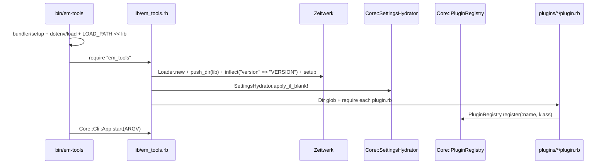
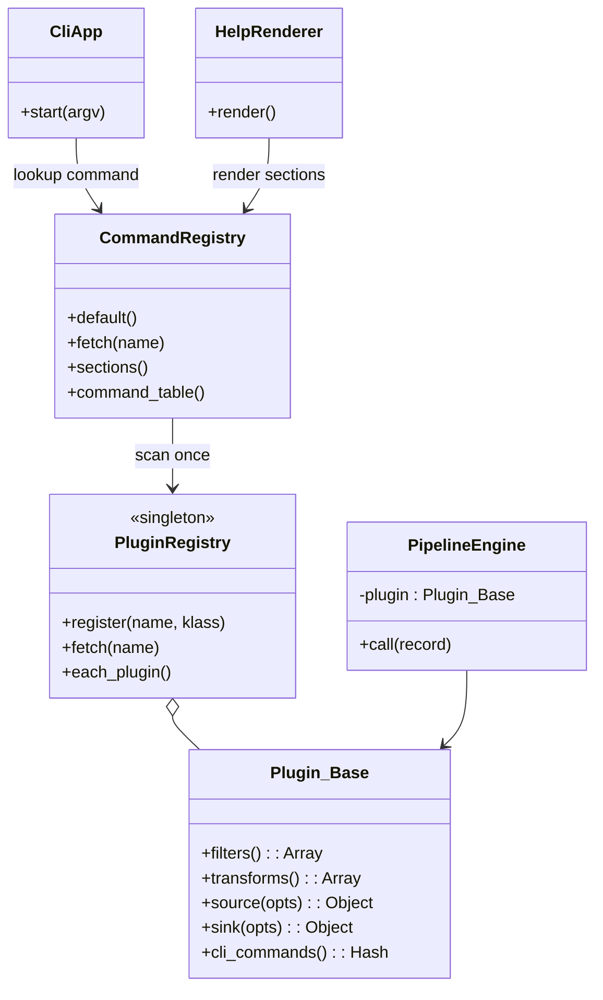
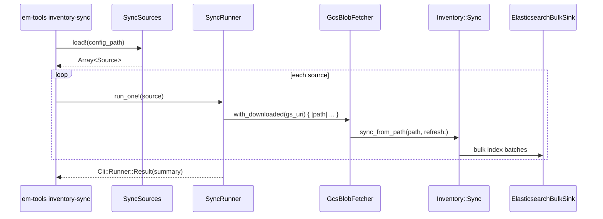

# Architecture

Reference for contributors who want to understand the codebase down to the
file level. For the high-level platform picture, start with
[`OVERVIEW.md`](OVERVIEW.md). For the public extension contract, see
[`PLUGINS.md`](PLUGINS.md). For the bounded-context / domain language view,
see [`DDD_AND_UBIQUITOUS_LANGUAGE.md`](DDD_AND_UBIQUITOUS_LANGUAGE.md).

---

## 1. Layers

We treat almost every workflow as a small ETL pipeline:

| Layer | Responsibility | Lives in |
|---|---|---|
| **Source** | Pull raw bytes / records (GCS, Spree, ES, HTTP, file) | `core/sinks/index_dumper` (read side), `clients/*`, plugin-specific `sources/` |
| **Decoding** | Parse NDJSON / CSV / JSON, validate minimal shape | `clients/*`, `plugins/*/queries/`, ad-hoc decoders |
| **Transform** | Field rename, currency normalisation, default-fill | plugin `transforms/` (e.g. `amazon_uploadable/transforms/price_calculator`) |
| **Filter** | Keep / drop / branch (blacklist, eligibility, price floors, category) | `core/rules/`, `core/blacklist/`, plugin `filters/` |
| **Sink** | Bulk-index to ES, write NDJSON | `core/sinks/elasticsearch_bulk_sink`, plugin `sinks/` |

I/O is kept at the edges (clients + sources + sinks). Business judgements
(filters, transforms) are pure functions of records, which keeps them
trivially testable.

---

## 2. Directory layout & namespaces

`lib/em_tools.rb` boots the project with an explicit
`Zeitwerk::Loader.new + push_dir("lib")`. The namespace exactly mirrors the
directory layout:

```
lib/em_tools/
  error.rb                                  EmTools::Error
  version.rb                                EmTools::VERSION

  core/                                     EmTools::Core
    cli/
      app.rb                                EmTools::Core::Cli::App
      runner.rb                             EmTools::Core::Cli::Runner
      commands/*.rb                         EmTools::Core::Cli::Commands::*
    plugin/
      base.rb                               EmTools::Core::Plugin::Base
    plugin_registry.rb                      EmTools::Core::PluginRegistry
    pipeline.rb                             EmTools::Core::Pipeline
    pipeline_engine.rb                      EmTools::Core::PipelineEngine
    config.rb                               EmTools::Core::Config
    errors.rb                               EmTools::Core::Errors::{ConfigurationError, EmptyResultError}
    logger.rb                               EmTools::Core::Logger
    settings_loader.rb / settings_hydrator  EmTools::Core::SettingsLoader / SettingsHydrator
    inventory/                              EmTools::Core::Inventory::*
    sinks/                                  EmTools::Core::Sinks::*
    rules/                                  EmTools::Core::Rules::*
    blacklist/                              EmTools::Core::Blacklist::*

bin/                                        project executables
  em-tools                                  the CLI (bundle exec bin/em-tools)
  console                                   IRB with em-tools loaded
  setup                                     bundle install + .env scaffold

  clients/                                  EmTools::Clients
    elasticsearch_client.rb                 EmTools::Clients::ElasticsearchClient
    spree_client.rb                         EmTools::Clients::SpreeClient
    gcs_blob_fetcher.rb                     EmTools::Clients::GcsBlobFetcher
    gcs_service_account_path.rb             EmTools::Clients::GcsServiceAccountPath
    exchange_rate.rb                        EmTools::Clients::ExchangeRate

  plugins/                                  EmTools::Plugins
    amazon_uploadable/                      EmTools::Plugins::AmazonUploadable
    amazon_lowest_offer/                    EmTools::Plugins::AmazonLowestOffer
    ebay/                                   EmTools::Plugins::Ebay
    storefront/                             EmTools::Plugins::Storefront
    lotteon/                                EmTools::Plugins::Lotteon
    ssg/                                    EmTools::Plugins::Ssg
```

A single Zeitwerk inflection is configured in `lib/em_tools.rb`:

- `version` → `VERSION` (so `lib/em_tools/version.rb` resolves to the
  constant `VERSION`, not `Version`).

The rest of the tree follows Zeitwerk's stock snake_case → CamelCase rule.

`bin/em-tools` adds `lib/` to `$LOAD_PATH` and `require`s `em_tools` directly
— there is no gemspec auto-magic; the executable is just a regular Ruby
script in the repo.

---

## 3. Boot sequence



`SettingsHydrator.apply_if_blank!` reads `config/settings.yml` and copies
**non-secret** structural defaults into ENV when the corresponding ENV var
is unset (currently `ELASTICSEARCH_URL` and `REDIS_URL`).

---

## 4. Plugin engine



- `Core::Plugin::Base` defines the contract; plugins inherit and override.
- `Core::PluginRegistry` is a process-global registry populated at load time.
- `Core::PipelineEngine` chains a plugin's filters and transforms over a
  record stream and writes to the plugin's sink. Used by the simpler
  per-record plugins; multi-stage workflows skip it and use a dedicated
  pipeline class instead.
- `Core::Cli::CommandRegistry` owns core command definitions, scans plugin
  `cli_commands` once, caches the resulting dispatch table, and resolves
  namespace-style aliases such as `inventory:sync`.
- `Core::Cli::HelpRenderer` renders usage text from the registry; `App` no
  longer owns presentation concerns.
- `Core::Cli::App` is now a thin lifecycle wrapper: detect help, validate the
  first argument, fetch a command definition from the registry, and dispatch.

See [`PLUGINS.md`](PLUGINS.md) for the contributor-facing contract.

---

## 5. CLI and error handling

```mermaid
flowchart LR
    Argv[ARGV] --> App[Core::Cli::App]
    App -->|fetch command| Registry[Core::Cli::CommandRegistry]
    App -->|help| Help[Core::Cli::HelpRenderer]
    Registry -->|dispatch| Cmd[Cli::Commands::* / Plugins::*::Cli::*]
    Cmd --> Runner[Cli::Runner.run { ... }]
    Runner -->|ConfigurationError, EmptyResultError| Warn[warn 'error: ...' + exit 1]
    Runner -->|Result.summary| Stdout[puts result.summary]
    Runner -->|other StandardError| Bug[propagate / stack trace]
```

Every CLI command body is wrapped in `Core::Cli::Runner.run`, which:

- Catches the gem's typed errors ({EmTools::Core::Errors::ConfigurationError},
  {EmTools::Core::Errors::EmptyResultError}) and emits a single-line
  `error: <msg>` + `exit 1`.
- Lets every other exception propagate so real bugs produce real stack
  traces.
- Prints `result.summary` if the block returned a `Cli::Runner::Result` (or
  any object responding to `#summary`).

This keeps each CLI command class to two responsibilities: argument parsing,
and "delegate to a pipeline / runner". The actual work always lives in a
pipeline / runner class under `lib/em_tools/<plugin>/pipelines/` (or
`runners/`).

---

## 6. Inventory sync (core, shared by every plugin)



Inventory sync is **core**, not a plugin: every plugin queries the same
`em_inventory` index. Source values (`AMZ_US`, `AMZ_CA`, `Boyner`, etc.)
identify per-marketplace inventory feeds and are also used for delisting
candidate generation.

`Core::Inventory::Sync` enforces that one CSV cannot mix multiple `Source`
values. `prune_obsolete: true` deletes documents in ES that were not seen in
the latest batch with the same `inventory_feed` — that is how inventory
goes from "rows in CSV" to "what's currently live".

---

## 7. When in doubt: where do I add this?

1. **A new external service** → `clients/<service>.rb`. Stay focused on
   transport (HTTP / GCS / ES wrapper). Logging via
   `EmTools::Core::Logger.for(progname: "<service>-client")`.

2. **A new core / shared concept** → `core/<topic>/`. Only justified if
   *every* plugin needs it (inventory, blacklist, rules, sinks).

3. **A new business workflow** → it's a plugin. Pick or create a
   `plugins/<scope>/`, drop your pipelines / runners / filters / transforms
   there, and expose a CLI command via `cli_commands`.

4. **A new variation of an existing workflow** → an additional CLI command
   (and possibly pipeline class) inside the existing plugin, **not** a new
   top-level rake-style entrypoint.

5. **A reusable record-level filter / transform** → `core/rules/` if it's
   genuinely cross-plugin, otherwise inside the relevant plugin's `filters/`
   or `transforms/`.

When tempted to put work directly inside a CLI command file, stop and ask
"is this two methods deep?" If yes, lift it to a `pipelines/` or `runners/`
class — keeps the CLI thin and the logic testable in isolation.
