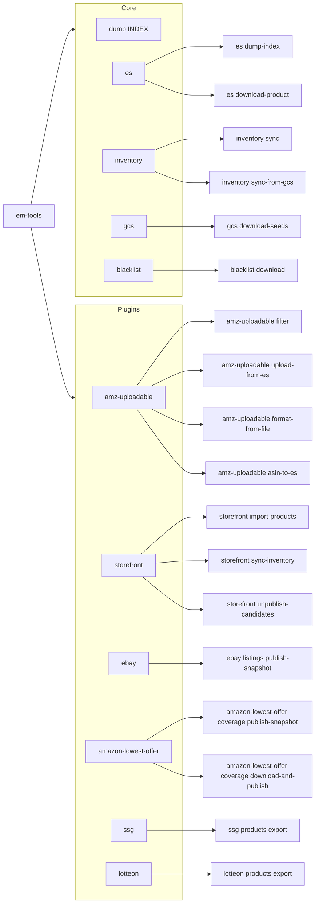

# em-tools CLI reference

`bin/em-tools` is the **only** operational entrypoint. The CLI is a hierarchical
subcommand tree built on [dry-cli](https://dry-rb.org/gems/dry-cli/), shaped
like `kubectl` / `git`:

```
em-tools <area> <action> [options] [arguments]
```

Every command:

- Loads `.env` automatically (via `dotenv`) when invoked through `bundle exec`.
- Wraps long-running work in {EmTools::Core::Cli::Runner}, which turns
  {EmTools::Core::Errors::ConfigurationError} and
  {EmTools::Core::Errors::EmptyResultError} into a one-line `error: <msg>` and
  `exit 1`.
- Prints a one-line `result.summary` on success.
- Supports `-h` / `--help` for per-command help.

## Help / discovery

```bash
bundle exec bin/em-tools                                # top-level command tree
bundle exec bin/em-tools <area>                          # subtree (e.g. inventory)
bundle exec bin/em-tools <area> <action> --help         # per-command help
```

`./bin/em-tools …` (without `bundle exec`) also works — the script calls
`bundler/setup` itself. For unattended / recurring invocation (cron, systemd
timers), see [`../schedule/README.md`](../schedule/README.md).

---

## Command index



| Path | Class |
|---|---|
| `dump INDEX` | `Core::Cli::Commands::Dump` |
| `es dump-index` | `Core::Cli::Commands::EsDumpIndex` |
| `es download-product` | `Core::Cli::Commands::EsDownloadProduct` |
| `inventory sync [CONFIG_PATH]` | `Core::Cli::Commands::InventorySync` |
| `inventory sync-from-gcs [GS_URI]` | `Core::Cli::Commands::InventorySyncFromGcs` |
| `gcs download-seeds` | `Core::Cli::Commands::GcsDownloadSeeds` |
| `blacklist download` | `Core::Cli::Commands::BlacklistDownload` |
| `amz-uploadable filter` | `Plugins::AmazonUploadable::Cli::UploadableProductFilter` |
| `amz-uploadable upload-from-es` | `Plugins::AmazonUploadable::Cli::AmzUploadProductsFromEs` |
| `amz-uploadable format-from-file PRODUCTS_PATH` | `Plugins::AmazonUploadable::Cli::AmzUploadableProductsFormatterFromFile` |
| `amz-uploadable asin-to-es` | `Plugins::AmazonUploadable::Cli::AsinProductsToEs` |
| `storefront import-products INPUT_PATH` | `Plugins::Storefront::Cli::ImportProducts` |
| `storefront sync-inventory` | `Plugins::Storefront::Cli::SyncInventory` |
| `storefront unpublish-candidates` | `Plugins::Storefront::Cli::UnpublishCandidates` |
| `ebay listings publish-snapshot [MARKETPLACE]` | `Plugins::Ebay::Cli::PublishSnapshot` |
| `amazon-lowest-offer coverage publish-snapshot [MARKETPLACES...]` | `Plugins::AmazonLowestOffer::Cli::PublishSnapshot` |
| `amazon-lowest-offer coverage download-and-publish` | `Plugins::AmazonLowestOffer::Cli::DownloadAndPublish` |
| `ssg products export` | `Plugins::Ssg::Cli::ExportProducts` |
| `lotteon products export` | `Plugins::Lotteon::Cli::ExportProducts` |

---

## Elasticsearch & extracts

### `dump INDEX`

Stream every document of an ES index as NDJSON. Cluster selection (explicit
URL, primary, or data) is delegated to `EmTools::Core::Config.elasticsearch_client`.

```bash
bundle exec bin/em-tools dump ssg_products > ssg_products.ndjson
bundle exec bin/em-tools dump user1_lotteon_products --data -o tmp/lotteon.ndjson
bundle exec bin/em-tools dump user1_kr_products -u 'http://user:pw@host:9200'
```

### `es dump-index`

Env-driven dump from the **primary** cluster (`ELASTICSEARCH_URL`) to a local
NDJSON file using the `ES_DUMP_*` env vars.

```bash
ES_DUMP_INDEX=user1_lotteon_products \
ES_DUMP_OUTPUT=tmp/lotteon.ndjson \
bundle exec bin/em-tools es dump-index
```

Required env: `ELASTICSEARCH_URL`, `ES_DUMP_INDEX`. Optional: `ES_DUMP_OUTPUT`
(default `tmp/<index>.ndjson`), `ES_DUMP_BATCH_SIZE` (default `1000`).

### `es download-product`

Like `es dump-index`, but reads from the **data cluster**
(`DATA_ELASTICSEARCH_URL`) and applies the keyword **blacklist policy** by default.

```bash
DATA_ELASTICSEARCH_URL='http://user:pw@host:9200' \
ES_DUMP_INDEX=user1_kr_products \
ES_DUMP_OUTPUT=tmp/kr_products.ndjson \
bundle exec bin/em-tools es download-product
```

For each hit, `EmTools::Core::Blacklist` selects the `product_download` rule
from `config/blacklist/source_rules.yml`. The current rule uses the
`title_brand` strategy: build the lowercased text `"<title> <brand>"` and run
it through an Aho-Corasick automaton seeded with the keywords returned by
`blacklist download`. Blacklisted hits are **not** written to the main NDJSON;
instead, one record per rejection is appended to `<output>.blocked.ndjson`
with the doc `_id`, title, brand, and matched keywords.

| Flag | Purpose |
|---|---|
| `--no-blacklist-filter` | Disable filtering entirely (raw dump). |
| `--title-field FIELD` | Source field for product title (default `title`). |
| `--brand-field FIELD` | Source field for product brand (default `brand`). |
| `--blocked-output PATH` | Override the blocked-products side-file path. |

---

## Inventory & object storage

### `inventory sync [CONFIG_PATH]`

Reads `inventory_sync.sources` from the merged settings YAML (or the file at
the given path) and streams every GCS CSV into the inventory ES index
(`em_inventory` by default).

Cluster precedence (highest wins):

1. per-source `cluster:` in YAML
2. `inventory_sync.cluster:` section default
3. `--data` flag (defaults sources without `cluster:` to `DATA_ELASTICSEARCH_URL`)
4. `ELASTICSEARCH_URL`

Required env: `ELASTICSEARCH_URL`. Optional: `GCS_SERVICE_ACCOUNT_PATH`,
`INVENTORY_INDEX`, `INVENTORY_DROP_FIELDS`.

### `inventory sync-from-gcs [GS_URI]`

Single-source debug variant. The URI can come from the CLI argument,
`INVENTORY_GS_URI`, or `INVENTORY_GCS_BUCKET` + `INVENTORY_GCS_OBJECT`.

Optional env: `INVENTORY_INDEX`, `INVENTORY_REFRESH=1`,
`INVENTORY_PRUNE_OBSOLETE=1`, `INVENTORY_FEED_ID`, `INVENTORY_DROP_FIELDS`
(comma-separated; e.g. `"handle,variants"`).

### `gcs download-seeds`

Pulls Amazon lowest-offer seed files (`AMZ_<MP>.txt`) from
`gs://$GCS_BUCKET/$GCS_SEEDS_PREFIX/` into `./tmp/amz_<mp>.txt`. Required
env: `GCS_SERVICE_ACCOUNT_PATH` (or default GCS credentials).

---

## Reference data

### `blacklist download`

Downloads the keyword blacklist from the Everymarket admin API. Used to refresh
the local keyword set that the storefront / Amazon importers feed into
`EmTools::Core::Blacklist` (Aho-Corasick).

```bash
# Print parsed keywords to stdout, one per line
bundle exec bin/em-tools blacklist download

# Persist to a file
bundle exec bin/em-tools blacklist download -o tmp/blacklist.txt

# Inspect the raw API response (useful when the schema changes)
bundle exec bin/em-tools blacklist download --raw -o tmp/blacklist.json
```

Required env: `BLACKLIST_API_ENDPOINT`, `BLACKLIST_API_PATH`,
`BLACKLIST_API_TOKEN` (or legacy `BLACKLIST_API_KEY`). The loader is
tolerant of legacy `{"blacklist_keywords":[{"keywords":[...]}]}` payloads as
well as flatter `{"keywords":[...]}` and bare-array responses, so a
server-side schema flip will not silently produce an empty list.

---

## Plugin commands

The following commands are **plugin-registered**; their availability depends
on the plugin being loaded (which it always is, since
`lib/em_tools.rb` eagerly loads every `plugins/*/plugin.rb`).

### Amazon uploadable (`plugins/amazon_uploadable/`)

| Command | What it does |
|---|---|
| `amz-uploadable filter` | Filter ASINs from one ES index against the rule engine and write the eligible-for-upload list. |
| `amz-uploadable upload-from-es` | Read filtered products from ES and run the Amazon upload pipeline. |
| `amz-uploadable format-from-file PRODUCTS_PATH` | Format a local file into the upload pipeline's input format. |
| `amz-uploadable asin-to-es` | Stage / index ASIN-keyed product documents into ES. |

### Amazon lowest-offer (`plugins/amazon_lowest_offer/`)

| Command | What it does |
|---|---|
| `amazon-lowest-offer coverage publish-snapshot [MARKETPLACES...]` | Publish lowest-offer coverage snapshots (one row per marketplace). |
| `amazon-lowest-offer coverage download-and-publish` | Composite: `gcs download-seeds` then `coverage publish-snapshot`. |

### eBay (`plugins/ebay/`)

| Command | What it does |
|---|---|
| `ebay listings publish-snapshot [MARKETPLACE]` | eBay listings coverage snapshot (one row per marketplace). |

### Storefront (`plugins/storefront/`)

| Command | What it does |
|---|---|
| `storefront import-products INPUT_PATH` | Filter local NDJSON product feeds against the rule engine. |
| `storefront sync-inventory` | Download per-source inventory CSVs from Spree and bulk-index into ES. |
| `storefront unpublish-candidates` | Iterate ES inventory, run rules, write delisting candidates to `em_products_to_unpublish`. |

### SSG / Lotteon (`plugins/ssg/`, `plugins/lotteon/`)

| Command | What it does |
|---|---|
| `ssg products export` | Stream SSG products from Elasticsearch as NDJSON. |
| `lotteon products export` | Stream Lotteon products from Elasticsearch as NDJSON. |

---

## Exit codes

| Exit code | When | Source |
|---|---|---|
| `0` | Success. `result.summary` printed if available. | normal return |
| `1` | Configuration / empty-result error. Single-line `error: <msg>` printed. | `Cli::Runner` catches `EmTools::Error` subclasses |
| `1` | Argument error (missing required argument, unknown option). | dry-cli built-in |
| anything else | Unexpected `StandardError` (real bug). | propagated, full stacktrace |

To call em-tools from another Ruby script in the same checkout, rescue the
top-level base class:

```ruby
begin
  EmTools::Plugins::AmazonLowestOffer::Pipelines::PublishSnapshot.new.run!
rescue EmTools::Error => e
  warn "em-tools refused: #{e.message}"
end
```
