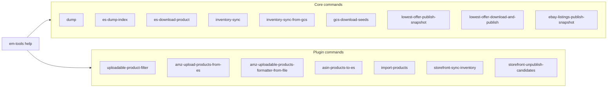

# em-tools CLI reference

`bin/em-tools` is the **only** operational entrypoint. Every command:

- Loads `.env` automatically (via `dotenv`) when invoked through `bundle exec`.
- Wraps its body in {EmTools::Core::Cli::Runner}, which turns
  {EmTools::Core::Errors::ConfigurationError} and
  {EmTools::Core::Errors::EmptyResultError} into a one-line `error: <msg>` and
  `exit 1`.
- Prints a one-line `result.summary` on success.
- Supports `-h` / `--help` for per-command help.

```bash
bundle exec bin/em-tools help                  # global help
bundle exec bin/em-tools <command> --help       # per-command help
```

`./bin/em-tools …` (without `bundle exec`) also works — the script calls
`bundler/setup` itself. For unattended / recurring invocation (cron, systemd
timers), see [`../schedule/README.md`](../schedule/README.md).

## Command names and namespace aliases

Built-in commands have a canonical hyphenated name (`inventory-sync`) and a
`namespace:command` alias that resolves to the same handler. They are
interchangeable; help text always prints the canonical form.

| Canonical | Alias |
|---|---|
| `inventory-sync` | `inventory:sync` |
| `inventory-sync-from-gcs` | `inventory:sync-from-gcs` |
| `gcs-download-seeds` | `gcs:download-seeds` |
| `es-dump-index` | `es:dump-index` |
| `es-download-product` | `es:download-product` |
| `lowest-offer-publish-snapshot` | `lowest-offer:publish-snapshot` |
| `lowest-offer-download-and-publish` | `lowest-offer:download-and-publish` |
| `ebay-listings-publish-snapshot` | `ebay-listings:publish-snapshot` |

Aliases live in {EmTools::Core::Cli::CommandNames::ALIASES}; plugin commands
do not currently expose namespaced aliases (see [`PLUGINS.md`](PLUGINS.md) if
you want to add one).

---

## Command index



| Group | Command | Class | Section |
|---|---|---|---|
| Elasticsearch | `dump` | `Core::Cli::Commands::Dump` | [Elasticsearch & extracts](#elasticsearch--extracts) |
| Elasticsearch | `es-dump-index` | `Core::Cli::Commands::EsDumpIndex` | [Elasticsearch & extracts](#elasticsearch--extracts) |
| Elasticsearch | `es-download-product` | `Core::Cli::Commands::EsDownloadProduct` | [Elasticsearch & extracts](#elasticsearch--extracts) |
| Inventory | `inventory-sync` | `Core::Cli::Commands::InventorySync` | [Inventory & GCS](#inventory--object-storage) |
| Inventory | `inventory-sync-from-gcs` | `Core::Cli::Commands::InventorySyncFromGcs` | [Inventory & GCS](#inventory--object-storage) |
| Inventory | `gcs-download-seeds` | `Core::Cli::Commands::GcsDownloadSeeds` | [Inventory & GCS](#inventory--object-storage) |
| Marketplace snapshots | `lowest-offer-publish-snapshot` | `Core::Cli::Commands::LowestOfferPublishSnapshot` | [Marketplace snapshots](#marketplace-monitoring-snapshots) |
| Marketplace snapshots | `lowest-offer-download-and-publish` | `Core::Cli::Commands::LowestOfferDownloadAndPublish` | [Marketplace snapshots](#marketplace-monitoring-snapshots) |
| Marketplace snapshots | `ebay-listings-publish-snapshot` | `Core::Cli::Commands::EbayListingsPublishSnapshot` | [Marketplace snapshots](#marketplace-monitoring-snapshots) |
| Plugin / Amazon | `uploadable-product-filter` | `Plugins::AmazonUploadable::Cli::UploadableProductFilter` | [Plugin commands](#plugin-commands) |
| Plugin / Amazon | `amz-upload-products-from-es` | `Plugins::AmazonUploadable::Cli::AmzUploadProductsFromEs` | [Plugin commands](#plugin-commands) |
| Plugin / Amazon | `amz-uploadable-products-formatter-from-file` | `Plugins::AmazonUploadable::Cli::AmzUploadableProductsFormatterFromFile` | [Plugin commands](#plugin-commands) |
| Plugin / Amazon | `asin-products-to-es` | `Plugins::AmazonUploadable::Cli::AsinProductsToEs` | [Plugin commands](#plugin-commands) |
| Plugin / Storefront | `import-products` | `Plugins::Storefront::Cli::ImportProducts` | [Plugin commands](#plugin-commands) |
| Plugin / Storefront | `storefront-sync-inventory` | `Plugins::Storefront::Cli::SyncInventory` | [Plugin commands](#plugin-commands) |
| Plugin / Storefront | `storefront-unpublish-candidates` | `Plugins::Storefront::Cli::UnpublishCandidates` | [Plugin commands](#plugin-commands) |

---

## Elasticsearch & extracts

### `dump`

Re-emits a slim summary of the current ES cluster state. Use as a smoke test
that auth + URL are configured.

### `es-dump-index`

Stream a single ES index from the **primary** cluster (`ELASTICSEARCH_URL`)
to a local NDJSON file using the `ES_DUMP_*` env vars.

```bash
ES_DUMP_INDEX=user1_lotteon_products \
ES_DUMP_OUTPUT=tmp/lotteon.ndjson \
bundle exec bin/em-tools es-dump-index
```

Required env: `ELASTICSEARCH_URL`, `ES_DUMP_INDEX`. Optional: `ES_DUMP_OUTPUT`
(default `tmp/<index>.ndjson`), `ES_DUMP_BATCH_SIZE` (default `1000`).

### `es-download-product`

Same plumbing as `es-dump-index`, but reads from the **data cluster**
(`DATA_ELASTICSEARCH_URL`). Useful for pulling read-only analytics indices.

```bash
DATA_ELASTICSEARCH_URL='http://user:pw@host:9200' \
ES_DUMP_INDEX=user1_kr_products \
ES_DUMP_OUTPUT=tmp/kr_products.ndjson \
bundle exec bin/em-tools es-download-product
```

---

## Inventory & object storage

### `inventory-sync [path/to/settings.yml]`

Reads `inventory_sync.sources` from the merged settings YAML (or the file at
the given path) and streams every GCS CSV into the inventory ES index
(`em_inventory` by default).

Required env: `ELASTICSEARCH_URL`. Optional: `GCS_SERVICE_ACCOUNT_PATH` (for
GCS auth), `INVENTORY_INDEX`.

### `inventory-sync-from-gcs [gs://bucket/path.csv]`

Single-source debug variant. The URI can come from the CLI argument,
`INVENTORY_GS_URI`, or `INVENTORY_GCS_BUCKET` + `INVENTORY_GCS_OBJECT`.

Optional env: `INVENTORY_INDEX`, `INVENTORY_REFRESH=1`,
`INVENTORY_PRUNE_OBSOLETE=1`, `INVENTORY_FEED_ID`.

### `gcs-download-seeds`

Pulls Amazon lowest-offer seed files (`AMZ_<MP>.txt`) from
`gs://$GCS_BUCKET/$GCS_SEEDS_PREFIX/` into `./tmp/amz_<mp>.txt`. Required
env: `GCS_SERVICE_ACCOUNT_PATH` (or default GCS credentials).

---

## Marketplace monitoring snapshots

### `lowest-offer-publish-snapshot [marketplace ...]`

Publishes a lowest-offer coverage snapshot (one row per marketplace) to ES.

- Optional positional args: marketplaces (e.g. `us ca jp` or `us,ca,jp`),
  otherwise `LOWEST_OFFER_MARKETPLACES`, otherwise the nine default markets.
- Result index: `monitoring_lowest_offer_snapshots` (configurable via
  `MONITORING_LOWEST_OFFER_SNAPSHOT_INDEX`).
- ASIN source mode: `LOWEST_OFFER_ID_SOURCE` (`inventory` to read ASINs from
  ES, otherwise seed-file mode reading `LOWEST_OFFER_SEED_DIR`).

See the `LOWEST_OFFER_*` block in [`.env.example`](../.env.example) for the
full list.

### `lowest-offer-download-and-publish`

Convenience composite: `gcs-download-seeds` followed by
`lowest-offer-publish-snapshot` with default marketplaces.

### `ebay-listings-publish-snapshot [marketplace]`

eBay listings coverage snapshot, one row per marketplace.

- Optional positional arg: marketplace (e.g. `us`), otherwise
  `EBAY_LISTINGS_COVERAGE_MARKETPLACE`, otherwise `us`.
- Inventory index: `EBAY_LISTINGS_COVERAGE_INVENTORY_INDEX` (default
  `ebay_us_products`).

See the `EBAY_LISTINGS_COVERAGE_*` block in
[`.env.example`](../.env.example) for the full list.

---

## Plugin commands

The following commands are **plugin-registered**; their availability depends
on the plugin being loaded (which it always is, since
`lib/em_tools.rb` eagerly loads every `plugins/*/plugin.rb`).

### Amazon (`plugins/amazon_uploadable/`)

| Command | What it does |
|---|---|
| `uploadable-product-filter` | Filter ASINs from one ES index against the rule engine and write the eligible-for-upload list. |
| `amz-upload-products-from-es` | Read filtered products from ES and run the Amazon upload pipeline. |
| `amz-uploadable-products-formatter-from-file` | Format a local file into the upload pipeline's input format. |
| `asin-products-to-es` | Stage / index ASIN-keyed product documents into ES. |

### Storefront (`plugins/storefront/`)

| Command | What it does |
|---|---|
| `import-products` | Filter local CSV / JSON product feeds against the rule engine. |
| `storefront-sync-inventory` | Download per-source inventory CSVs from Spree and bulk-index into ES. |
| `storefront-unpublish-candidates` | Iterate ES inventory, run rules, write delisting candidates to `em_products_to_unpublish`. |

---

## Exit codes

| Exit code | When | Source |
|---|---|---|
| `0` | Success. `result.summary` printed if available. | normal return |
| `1` | Configuration / empty-result error. Single-line `error: <msg>` printed. | `Cli::Runner` catches `EmTools::Error` subclasses |
| `1` | Argument error (extra positional args, `--bad-flag`). | per-command `OptionParser` |
| anything else | Unexpected `StandardError` (real bug). | propagated, full stacktrace |

To call em-tools from another Ruby script in the same checkout, rescue the
top-level base class:

```ruby
begin
  EmTools::Plugins::AmazonLowestOffer::Pipelines::PublishSnapshot.new.run!
rescue EmTools::Error => e
  warn "em-tools refused: #{e.message}"
end
```
