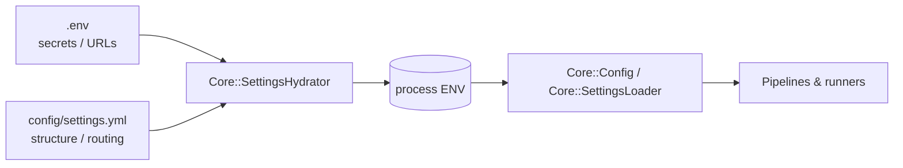

# Configuration

em-tools uses a strict two-file split:

| File | Purpose | Tracked in git? |
|---|---|---|
| **`.env`** (copy of [`.env.example`](../.env.example)) | All secrets, real cluster URLs, per-environment toggles | **No** |
| **`config/settings.yml`** | Structure: routing tables, exporter→cluster→index map, GCS bucket names, inventory source lists | Yes (no secrets) |

The CLI auto-loads `.env` (via `dotenv`) before running any command, both
when invoked interactively (`bundle exec bin/em-tools …`) and when invoked
from the systemd / cron templates in [`schedule/`](../schedule/).



The rule of thumb:

> **Anything secret or environment-specific (URLs with credentials, API
> keys, file paths) → `.env`. Anything you'd happily commit to a public
> repo (bucket names, exporter routing, source lists) → `settings.yml`.**

If a value is set in both, **`.env` always wins**. `SettingsHydrator` only
copies YAML values into ENV when the ENV variable is unset, and never for
the explicitly secret keys.

---

## `.env` — the secret file

Start from [`.env.example`](../.env.example) and fill in real values for the
sections you use. The example file is grouped by feature so you only have to
read the parts that apply to your task.

| Group | Required for | Key vars |
|---|---|---|
| Application | always | `APP_ENV` |
| Logging | always | `EM_TOOLS_LOG_LEVEL`, `EM_TOOLS_LOG_OUTPUT`, `EM_TOOLS_LOG_FORMAT` |
| Elasticsearch (primary) | most commands | `ELASTICSEARCH_URL`, `ELASTICSEARCH_USERNAME`, `ELASTICSEARCH_PASSWORD`, `ELASTICSEARCH_API_KEY` |
| Elasticsearch (data) | `es download-product` | `DATA_ELASTICSEARCH_URL` |
| Per-cluster | dynamic routing | `ELASTICSEARCH_CLUSTER_<NAME>_URL` |
| ES dump | `es dump-index` | `ES_DUMP_*` |
| GCS | inventory + seeds | `GCS_SERVICE_ACCOUNT_PATH` (or `GCS_CREDENTIALS` + `GCS_PROJECT_ID`) |
| GCS routing | seeds + inventory | `GCS_BUCKET`, `GCS_SEEDS_PREFIX` |
| Inventory | inventory sync | `INVENTORY_INDEX`, `INVENTORY_GS_URI` / `INVENTORY_GCS_*`, `INVENTORY_REFRESH`, `INVENTORY_PRUNE_OBSOLETE`, `INVENTORY_FEED_ID` |
| Google Ads catalog | google-ads catalog sync | `GOOGLE_ADS_CATALOG_INDEX`, `GOOGLE_ADS_CATALOG_GS_URI` / `GOOGLE_ADS_CATALOG_GCS_*`, `GOOGLE_ADS_CATALOG_REFRESH`, `GOOGLE_ADS_CATALOG_PRUNE_OBSOLETE`, `GOOGLE_ADS_CATALOG_FEED_ID` |
| Amazon lowest-offer | snapshot | `LOWEST_OFFER_*`, `MONITORING_LOWEST_OFFER_SNAPSHOT_INDEX`, `MONITORING_ES_INDEX_REFRESH` |
| eBay coverage | snapshot | `EBAY_LISTINGS_COVERAGE_*` |
| Redis | optional | `REDIS_URL` |
| Blacklist API | uploadable filter | `BLACKLIST_API_ENDPOINT`, `BLACKLIST_API_PATH`, `BLACKLIST_API_TOKEN` |
| Per-site | partner sites | `EM_TOOLS_SITE_<NAME>_BASE_URL`, `_ENDPOINT`, `_TOKEN` |
| Settings overrides | rare | `EM_TOOLS_SETTINGS_PATH`, `EM_TOOLS_SKIP_SETTINGS_HYDRATE` |

**Never put any of these in `settings.yml`:**

- `ELASTICSEARCH_URL`, `DATA_ELASTICSEARCH_URL`, anything with auth in the URL.
- `GCS_SERVICE_ACCOUNT_PATH`, `GCS_CREDENTIALS`, `GCS_PROJECT_ID`.
- `BLACKLIST_API_*`.

`Core::SettingsHydrator` enforces this: it only copies non-secret structural
values from YAML to ENV (currently just `ELASTICSEARCH_URL` and `REDIS_URL`,
both of which fall back to `localhost` for local dev convenience).

---

## `config/settings.yml` — the structural file

```yaml
default: &default
  elasticsearch:
    url: http://localhost:9200       # local dev fallback only; .env always wins

  elasticsearch_clusters:            # routing table; pick by exporter
    primary:                         # ELASTICSEARCH_CLUSTER_PRIMARY_URL overrides
      url: http://localhost:9200
    analytics:
      url: http://localhost:9200

  exporters:                         # exporter -> cluster + index
    ssg_products:
      cluster: primary
      index: ssg_products
    lotteon_products:
      cluster: analytics
      index: user1_lotteon_products
    lazada_th_products:
      cluster: primary
      index: user1_lazadacoth_products
    lazada_my_products:
      cluster: primary
      index: user1_lazadamys_products

  # Per-marketplace Lazada CLI (+em-tools lazada -m th|my+). Optional YAML overrides.
  lazada_marketplaces:
    # my:
    #   translate_by_default: true
    #   translation_index: em_title_translations_my
    #   extra_es_filters:
    #     - term: { marketplace: "MY" }

  redis:
    url: redis://localhost:6379/0    # .env REDIS_URL overrides

  gcs:
    buckets:                         # bucket *names* only, never keys
      inventory: em-bucket

  sites:                             # placeholder structure for per-site config
    example_partner:
      base_url: https://partner.example.com
      endpoint: https://partner.example.com/api/v1

  inventory_sync:
    index: em_inventory
    refresh: false
    prune_obsolete: false
    sources: []
    # Template form for AMZ_{marketplace}-Inv.csv (expands to one gs:// URI per code):
    # - gs_uri_template: gs://em-bucket/AMZ_{marketplace}-Inv.csv
    #   marketplaces: all    # or [TR, DE, UK] — _id is CSV ProductID -> product_id

  google_ads_catalog_sync:
    index: google_ads_products
    refresh: false
    prune_obsolete: false
    sources: []

development:
  <<: *default
  inventory_sync:
    sources:
      - gs://em-bucket/AMZ_AE-Inv.csv
      - gs://em-bucket/AMZ_CA-Inv.csv

production:
  <<: *default
  inventory_sync:
    sources:
      - gs://em-bucket/boyner-Inv.csv
```

### Merging rules

- The active section is selected by `APP_ENV` (`RAILS_ENV` / `RACK_ENV` are
  also accepted). Default: `development`.
- The `default` block is deep-merged with the active section.
- ERB is supported in YAML values.
- Use `EM_TOOLS_SETTINGS_PATH=/abs/path/to/file.yml` to point at a different
  YAML; `EM_TOOLS_SKIP_SETTINGS_HYDRATE=1` disables the YAML→ENV bridge
  entirely.

### Inventory `sources`

GCS paths for `em-tools inventory sync` live under `inventory_sync.sources` in
the active `APP_ENV` section (default `development`). Each entry can be either a
bare `gs://` URI or a hash.

**Fixed URI** (one file per entry):

```yaml
sources:
  - gs://em-bucket/AMZ_US-Inv.csv

  - uri: gs://em-bucket/Ebay_US-Inv.csv
    cluster: data                      # optional: data | primary | elasticsearch_clusters key
    index: em_inventory                # override per-source
    refresh: true
    prune_obsolete: true
    feed_id: AMZ_CA                    # explicit feed_id; otherwise inferred from CSV Source col
```

**Template URI** (one YAML entry → many GCS files). Use when Amazon inventory
files follow `AMZ_<code>-Inv.csv` on the bucket:

```yaml
sources:
  - gs_uri_template: gs://em-bucket/AMZ_{marketplace}-Inv.csv
    marketplaces: all                  # expands to AE CA US DE UK IN IT MX JP TR
  # - gs_uri_template: gs://em-bucket/AMZ_{marketplace}-Inv.csv
  #   marketplaces: [DE, UK, TR]       # only these codes (uppercased)
  # - gs_uri_template: gs://em-bucket/AMZ_{marketplace}-Inv.csv
  #   marketplaces: "DE,UK"           # comma-separated string also works
```

| `marketplaces` value | Expanded codes |
|---|---|
| `all` (string or one-element array `["all"]`) | `AE`, `CA`, `US`, `DE`, `UK`, `IN`, `IT`, `MX`, `JP`, `TR` |
| `[DE, uk]` | `DE`, `UK` (array entries are uppercased) |
| `"TR,DE"` | `TR`, `DE` |

The literal placeholder `{marketplace}` in `gs_uri_template` (aliases:
`template`, `uri_template`) is replaced with each code via string substitution,
e.g. `gs://em-bucket/AMZ_{marketplace}-Inv.csv` + `DE` →
`gs://em-bucket/AMZ_DE-Inv.csv`. The code is the **filename site token**, not an
AWS marketplace API id.

To sync all expanded AMZ files in one run:

```bash
APP_ENV=development ELASTICSEARCH_URL='http://…' bundle exec bin/em-tools inventory sync
```

To sync **one** marketplace without editing YAML, use
`inventory sync-from-gcs gs://em-bucket/AMZ_DE-Inv.csv` (see [CLI.md](CLI.md)).

### Per-site

Anything under `sites.<name>.{base_url,endpoint,token}` is hydrated into
`ENV["EM_TOOLS_SITE_<NAME>_*"]` (uppercased, `-` → `_`) **only if** the
target env var is unset. This lets you commit non-sensitive structural
defaults and override per-environment with `.env`.

---

## Logging

Logging is centralised in {EmTools::Core::Logger}. Every component obtains
its logger via `EmTools::Core::Logger.for(progname: "<name>")`, so output is
consistent across the gem.

| Env | Default | Effect |
|---|---|---|
| `EM_TOOLS_LOG_LEVEL` | `info` | `debug` / `info` / `warn` / `error` / `fatal` |
| `EM_TOOLS_LOG_OUTPUT` | `stderr` | `stderr`, `stdout`, or an absolute file path (append + sync) |
| `EM_TOOLS_LOG_FORMAT` | `text` | `text` (human-readable) or `json` (one event per line) |

Tests run silenced; production deployments typically set
`EM_TOOLS_LOG_FORMAT=json` and pipe `stderr` to the host log shipper.
