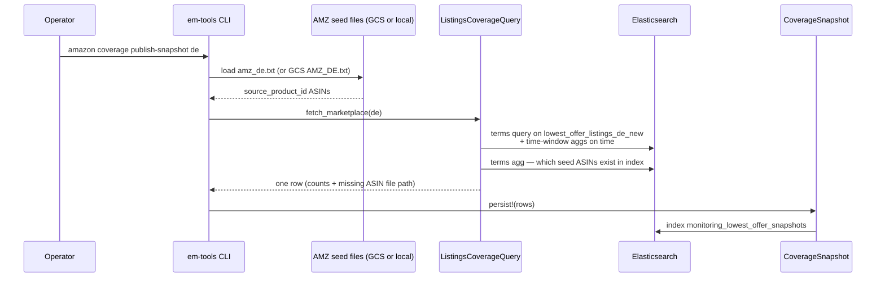

# Amazon lowest-offer coverage (刊登新鲜度)

Given a set of **watched ASINs** (typically from Google Ads / promotion seed
files), em-tools queries Elasticsearch index
`lowest_offer_listings_<marketplace>_new` and aggregates listing documents by
the **`time` field** to measure freshness and coverage. Results are written as
one snapshot row per marketplace into `monitoring_lowest_offer_snapshots`
(configurable).

For the full CLI index, see [`CLI.md`](CLI.md). For env vars, see
[`.env.example`](../.env.example) and [`CONFIGURATION.md`](CONFIGURATION.md).

---

## Quick answer: which command?

**Cron entry point (recommended for daily jobs):**

```bash
bin/amazon-lowest-offer-snapshot
```

Equivalent to `bundle exec bin/em-tools amazon coverage download-and-publish`.
Optional marketplace subset: `bin/amazon-lowest-offer-snapshot de us`.

Set `EM_TOOLS_BUNDLE` when cron cannot find `bundle` (e.g.
`/home/Admin/.rbenv/shims/bundle`). See
[`schedule/cron.amazon-lowest-offer.example`](../schedule/cron.amazon-lowest-offer.example).

**Daily / production (same pipeline, via em-tools directly):**

```bash
bundle exec bin/em-tools amazon coverage download-and-publish
```

**Publish only** (seeds already local or streamed from GCS in memory):

```bash
# All default marketplaces (in, it, ae, ca, mx, de, jp, uk, us)
bundle exec bin/em-tools amazon coverage publish-snapshot

# Subset
bundle exec bin/em-tools amazon coverage publish-snapshot us ca de
```

**Download seed files without publishing** (optional prep step):

```bash
bundle exec bin/em-tools gcs download-seeds
```

---

## What it does (end to end)



1. **Load watched ASINs** — from ad-report seed files or from `em_inventory`
   (see [ASIN source modes](#asin-source-modes) below).
2. **Query** `lowest_offer_listings_<mp>_new` with a `terms` filter on
   `asin.keyword` (override: `LOWEST_OFFER_ASIN_FIELD`), scoped to those
   ASINs only.
3. **Judge freshness** — aggregate matching documents into buckets by the
   `time` field (override: `LOWEST_OFFER_TIME_FIELD`, default `time`).
4. **Measure coverage** — count how many seed ASINs have at least one listing
   doc; optionally write missing ASINs to a local file.
5. **Persist snapshot** — one document per marketplace in the monitoring index.

Implementation: `EmTools::Plugins::Amazon::LowestOffer::Queries::ListingsCoverageQuery`.

---

## ASIN source modes

| Mode | ENV | Where ASINs come from |
|---|---|---|
| **Seed (default)** | `LOWEST_OFFER_ID_SOURCE=seed` or unset | Tab-separated seed files: local `amz_<mp>.txt` / `ebay_<mp>.txt`, or GCS `AMZ_<MP>.txt` |
| **Inventory** | `LOWEST_OFFER_ID_SOURCE=inventory` | Distinct Amazon ASINs from `em_inventory` (see [`INVENTORY_SYNC.md`](INVENTORY_SYNC.md)) |

### Seed files from ad reports

Seed files are the usual link between **Google Ads / promotion feeds** and
this pipeline:

- **GCS path:** `gs://$GCS_BUCKET/$GCS_SEEDS_PREFIX/sources/AMZ_<MP>.txt`
  (default prefix `em-analytics`).
- **Local path:** `$LOWEST_OFFER_SEED_DIR/amz_<mp>.txt` (e.g. `./tmp/amz_de.txt`
  after `gcs download-seeds`).

Each non-empty line is tab-separated; **column 2** (0-based index 1) is JSON.
The ASIN used for ES lookup is JSON key **`source_product_id`** (uppercased).

Example line:

```
ignored_column	{"source_product_id":"B07X7ZDJQB","product_id":12345}
```

If JSON is truncated, a regex fallback tries to recover `"source_product_id":"…"`
when the value looks like an ASIN.

### How seeds reach the command

| Setup | Behaviour |
|---|---|
| `LOWEST_OFFER_SEED_DIR` **unset** | Stream `AMZ_<MP>.txt` from GCS in memory (needs GCS credentials). |
| `LOWEST_OFFER_SEED_DIR=tmp` | Read local `tmp/amz_<mp>.txt`; download missing files from GCS. |
| `LOWEST_OFFER_SEEDS_FORCE_DOWNLOAD=1` | Re-download seeds even if local file exists. |

Composite command `amazon coverage download-and-publish` syncs seeds to
`./tmp` then runs `publish-snapshot`.

---

## Elasticsearch indices

| Index | Role |
|---|---|
| `lowest_offer_listings_<mp>_new` | **Queried** — one listing document per offer; fields include `asin`, `time`. |
| `monitoring_lowest_offer_snapshots` | **Written** — one snapshot row per marketplace per run (`MONITORING_LOWEST_OFFER_SNAPSHOT_INDEX`). |

`<mp>` is lowercase marketplace code: `de`, `us`, `uk`, etc.

---

## Interpreting the `time` field (freshness windows)

For each seed ASIN batch, the query counts **listing documents** (not ASINs)
in these buckets:

| Snapshot field | Meaning |
|---|---|
| `time_last_24h` | `time` in `[now-24h, now)` |
| `time_24_to_48h_ago` | `time` in `[now-48h, now-24h)` |
| `time_48_to_72h_ago` | `time` in `[now-72h, now-48h)` |
| `time_72_to_96h_ago` | `time` in `[now-96h, now-72h)` |
| `time_96_to_120h_ago` | `time` in `[now-120h, now-96h)` |
| `time_older_than_120h` | `time` exists and `time < now-120h` |
| `time_at_or_after_now` | `time >= now` (clock skew / future timestamps) |
| `time_other_window` | Has `time` but outside the buckets above |
| `docs_missing_time` | Document exists but **no** `time` field |

**Coverage fields (ASIN counts, not document counts):**

| Field | Meaning |
|---|---|
| `seed_asins_loaded` / `seed_asins_unique` | ASINs read from seed / deduplicated count |
| `seed_asins_found_in_index` | Seed ASINs with ≥1 doc in `lowest_offer_listings_*_new` |
| `seed_asins_missing_from_index` | Seed ASINs with no listing doc |
| `missing_asins_file` | Path to `missing_asins_<mp>.txt` when enabled |
| `seed_listing_docs_total` | Total listing docs matching seed ASINs |
| `time_activity_docs_sum` | Sum of all `time_*` + `docs_missing_time` buckets (should equal `seed_listing_docs_total`) |

**Practical validity check:** for ad-report ASINs you usually care that
`seed_asins_found_in_index` is high and recent activity (`time_last_24h` /
`time_24_to_48h_ago`) covers most listing docs. ASINs in
`missing_asins_<mp>.txt` have **no** row in the lowest-offer index at all.

At publish time, window boundaries are frozen to **`snapshot_time`** (UTC) so
all marketplaces in one run share the same clock.

---

## Environment variables

| Variable | Default | Purpose |
|---|---|---|
| `LOWEST_OFFER_ID_SOURCE` | `seed` | `seed` or `inventory` |
| `LOWEST_OFFER_SEED_DIR` | _(empty → GCS in memory)_ | Local directory for `amz_<mp>.txt` |
| `LOWEST_OFFER_MARKETPLACES` | 9 default markets | Comma list when CLI args omitted |
| `LOWEST_OFFER_TIME_FIELD` | `time` | ES date field for freshness aggs |
| `LOWEST_OFFER_ASIN_FIELD` | `asin.keyword` | ES field for `terms` filter |
| `LOWEST_OFFER_TERMS_BATCH_SIZE` | `2000` | ASINs per ES request (200–5000) |
| `LOWEST_OFFER_WRITE_MISSING_ASINS` | `true` | Write `missing_asins_<mp>.txt` |
| `LOWEST_OFFER_MISSING_ASINS_DIR` | `tmp/lowest_offer_missing_asins` | Output dir; `-` disables |
| `LOWEST_OFFER_SEEDS_FORCE_DOWNLOAD` | unset | `1` = overwrite local seeds from GCS |
| `MONITORING_LOWEST_OFFER_SNAPSHOT_INDEX` | `monitoring_lowest_offer_snapshots` | Snapshot sink index |
| `MONITORING_ES_INDEX_REFRESH` | unset | `true` = refresh after each index |
| `GCS_BUCKET` / `GCS_SEEDS_PREFIX` | `em-bucket` / `em-analytics` | Seed download source |
| `GCS_SERVICE_ACCOUNT_PATH` | — | Required for GCS seed modes |

**Inventory mode only** (`LOWEST_OFFER_ID_SOURCE=inventory`):

| Variable | Default |
|---|---|
| `LOWEST_OFFER_INVENTORY_INDEX` | `em_inventory` |
| `LOWEST_OFFER_INVENTORY_PRODUCT_ID_FIELD` | `source_product_id` |
| `LOWEST_OFFER_INVENTORY_SOURCE_FIELD` | `source.keyword` |
| `LOWEST_OFFER_INVENTORY_AMAZON_SOURCES` | _(empty)_ |
| `LOWEST_OFFER_INVENTORY_MARKETPLACE_FIELD` | _(optional)_ |
| `LOWEST_OFFER_INVENTORY_MAX_HITS` | _(optional cap)_ |

Requires `ELASTICSEARCH_URL` (primary cluster).

---

## Examples

### Local seeds, single marketplace

```bash
LOWEST_OFFER_SEED_DIR=tmp \
bundle exec bin/em-tools amazon coverage publish-snapshot de
```

### Use inventory ASINs instead of ad-report seeds

```bash
LOWEST_OFFER_ID_SOURCE=inventory \
LOWEST_OFFER_INVENTORY_AMAZON_SOURCES=AMZ_DE,AMZ_US \
bundle exec bin/em-tools amazon coverage publish-snapshot de us
```

### Scheduled run (cron / systemd)

**Cron (daily at 04:00):**

```bash
sudo cp schedule/cron.amazon-lowest-offer.example /etc/cron.d/em-tools-amazon-lowest-offer
sudoedit /etc/cron.d/em-tools-amazon-lowest-offer   # USER, REPO, EM_TOOLS_BUNDLE
```

Example line (user `Admin`, rbenv):

```cron
0 4 * * *  Admin  bash -lc 'export EM_TOOLS_BUNDLE=/home/Admin/.rbenv/shims/bundle; cd /home/Admin/src/em-tools && bin/amazon-lowest-offer-snapshot >> log/em-tools.lowest-offer.log 2>&1'
```

Before enabling cron, verify once by hand:

```bash
export EM_TOOLS_BUNDLE=/home/Admin/.rbenv/shims/bundle
cd /home/Admin/src/em-tools
cp .env.example .env   # first time only — fill in ELASTICSEARCH_URL, GCS creds
bin/amazon-lowest-offer-snapshot
```

See [`schedule/README.md`](../schedule/README.md) and
`schedule/systemd/em-tools-lowest-offer-snapshot.service.example` — default:

```bash
bundle exec bin/em-tools amazon coverage download-and-publish
```

---

## Related commands

| Command | Relationship |
|---|---|
| `gcs download-seeds` | Download `AMZ_*.txt` to `./tmp` only |
| `inventory sync` | Feeds `em_inventory` when using `LOWEST_OFFER_ID_SOURCE=inventory` |
| `google-ads catalog missing-product-ids` | Different workflow — inventory vs Google Ads **catalog** index, not lowest-offer listings |

Domain vocabulary: [`DDD_AND_UBIQUITOUS_LANGUAGE.md`](DDD_AND_UBIQUITOUS_LANGUAGE.md)
(sections on **刊登新鲜度** and **选品种子**).
