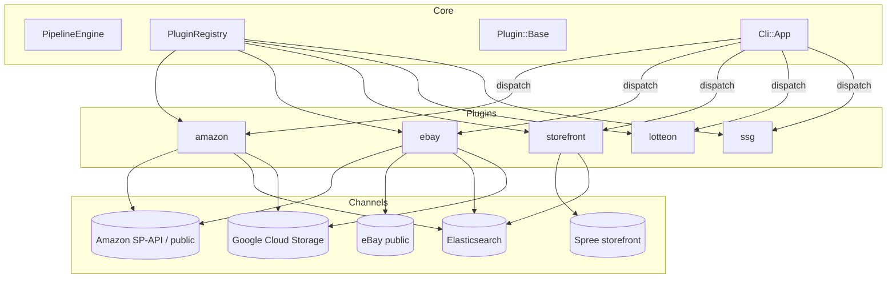
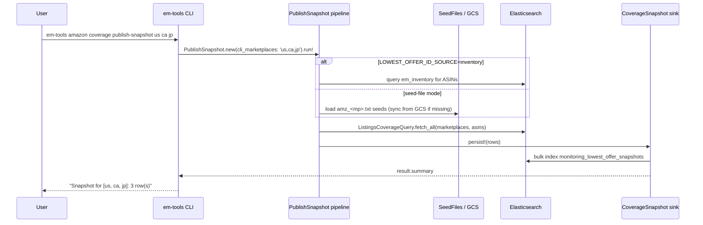

# em-tools — Platform overview

This document is the 5-minute mental model of **em-tools**: what it is, how
data flows, and where each piece lives. Pair it with [`CLI.md`](CLI.md) (the
command surface), [`PLUGINS.md`](PLUGINS.md) (extension points), and
[`../schedule/README.md`](../schedule/README.md) (recurring jobs).

---

## 1. What em-tools is

em-tools is the **Everymarket data-management platform** — a project-local
Ruby application driven by:

- a single CLI binary at [`bin/em-tools`](../bin/em-tools), and
- cron / systemd timers in [`schedule/`](../schedule/) that invoke the same
  binary on a fixed cadence.

It is not a published gem and intentionally has no `.gemspec` / build /
install / release flow. It coordinates four kinds of work:

1. **Source pulls** — fetch raw inventory / coverage data from GCS, Spree, ES,
   external HTTP APIs.
2. **Filtering & transformation** — apply per-marketplace business rules
   (eligibility, blacklist, price floors, ad cost, etc.).
3. **Coverage / monitoring snapshots** — emit one or more "did our products
   make it onto the marketplace?" rows per marketplace per run.
4. **Sink writes** — bulk-index into Elasticsearch (always), occasionally
   write NDJSON dumps for debugging.

Everything else — Rake business tasks, scripts, ad-hoc Ruby files — has been
removed. The CLI is the **only operational surface**; recurring work is just
a cron / systemd timer that runs the same CLI.

---

## 2. The pipeline mental model

Every workflow is a small ETL pipeline:


The **core engine** ({`EmTools::Core::PipelineEngine`}) only knows how to
chain filters → transforms → sinks. Every concrete pipeline (Amazon
lowest-offer snapshot, eBay coverage, inventory sync, etc.) is a class that
stitches together its own sources / filters / transforms / sink and exposes a
`#run!` method.

CLI commands are intentionally thin: they parse arguments, hand off to a
pipeline class, and let `EmTools::Core::Cli::Runner` translate
`ConfigurationError` / `EmptyResultError` into a clean `error: <msg>` +
`exit 1`.

---

## 3. The plugin engine

em-tools is plugin-driven. The core has **zero business knowledge**; every
marketplace / channel is a plugin.



Each plugin under `lib/em_tools/plugins/<name>/` provides up to four kinds of
contributions:

| Contribution | Method on plugin | Used by |
|---|---|---|
| Filters | `#filters` | `Core::PipelineEngine` |
| Transforms | `#transforms` | `Core::PipelineEngine` |
| Source | `#source` | pipelines / engine |
| Sink | `#sink` | pipelines / engine |
| CLI commands | `#cli_commands` | `Core::Cli::App` |
| High-level operations | plain instance methods | callers, specs |

See [`PLUGINS.md`](PLUGINS.md) for the full plugin contract.

---

## 4. Plugin scopes today

| Scope | Directory | What it owns |
|---|---|---|
| `amazon/uploadable` | `plugins/amazon/uploadable/` | "Can we upload this product to Amazon?" rules + ASIN product index pipeline + the upload runner. |
| `amazon/lowest_offer` | `plugins/amazon/lowest_offer/` | Lowest-offer monitoring snapshot, seed-file plumbing, offer filter / service. |
| `ebay` | `plugins/ebay/` | eBay listings coverage snapshot. |
| `storefront` | `plugins/storefront/` | Spree storefront sync (download + delisting candidates). |
| `lotteon` | `plugins/lotteon/` | Lotteon-specific pricing / catalog rules. |
| `ssg` | `plugins/ssg/` | SSG-specific pricing / catalog rules. |

Inventory sync is **core** (`lib/em_tools/core/inventory/`) because every
plugin shares the same `em_inventory` ES index.

---

## 5. End-to-end example: lowest-offer snapshot



The same shape (CLI → pipeline → query/source → sink → ES) repeats for the
eBay snapshot, the inventory sync, and the storefront unpublish-candidates
runner.

---

## 6. Error contract

Every CLI command body looks like this:

```ruby
EmTools::Core::Cli::Runner.run do
  EmTools::Plugins::Foo::Pipelines::Bar.new(...).run!
end
```

`Cli::Runner.run`:

- Catches `EmTools::Core::Errors::ConfigurationError` (missing env / config)
  and `EmTools::Core::Errors::EmptyResultError` (pipeline produced nothing
  meaningful) and emits `error: <msg>` + `exit 1`.
- Lets every other exception propagate (those are real bugs).
- Prints `result.summary` if the pipeline returns a `Cli::Runner::Result` (or
  any object responding to `#summary`).

Both error classes inherit from `EmTools::Error`, so callers integrating the
gem can `rescue EmTools::Error` to catch any em-tools-specific failure.

---

## 7. Where to go next

- [`CLI.md`](CLI.md) — every CLI command, args, env vars.
- [`CONFIGURATION.md`](CONFIGURATION.md) — `.env` vs `settings.yml` split.
- [`PLUGINS.md`](PLUGINS.md) — how to add a plugin.
- [`ARCHITECTURE.md`](ARCHITECTURE.md) — files, namespaces, Zeitwerk.
- [`../schedule/README.md`](../schedule/README.md) — wiring up cron /
  systemd timers.
