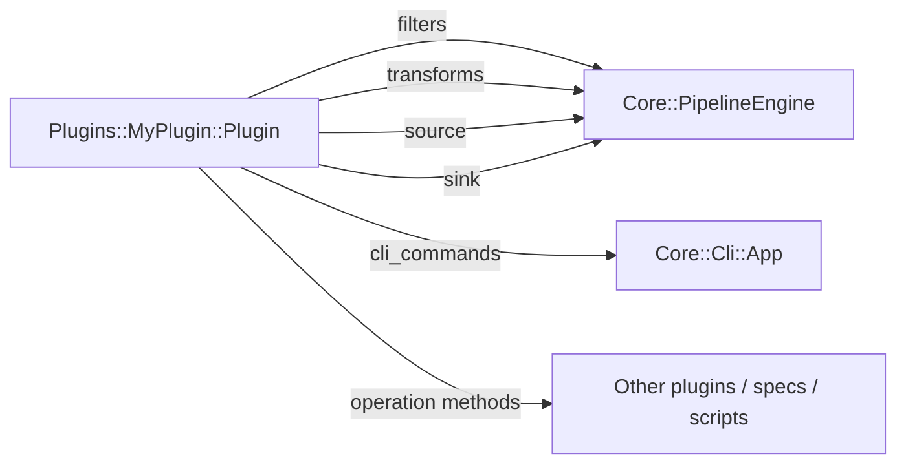

# Plugins

em-tools is plugin-driven: the **core** has zero business knowledge, and
every marketplace / channel lives under `lib/em_tools/plugins/<scope>/`. This
document is the plugin contract — read it before adding a new plugin or a
new CLI command.

> em-tools is a project-local Ruby application, not a packaged gem; the
> "plugin" concept is internal to this checkout, not a rubygems extension
> point. New plugins are checked into the same repo.

## Plugin contract

Every plugin is a Ruby class under `EmTools::Plugins::<Name>` that inherits
from {EmTools::Core::Plugin::Base} and self-registers with the registry on
load:

```ruby
# lib/em_tools/plugins/my_plugin/plugin.rb
module EmTools
  module Plugins
    module MyPlugin
      class Plugin < EmTools::Core::Plugin::Base
        EmTools::Core::PluginRegistry.register(:my_plugin, self)
      end
    end
  end
end
```

`lib/em_tools.rb` requires every `plugins/*/plugin.rb` at load time, so the
registration is automatic. Everything else under your plugin directory is
autoloaded by Zeitwerk, no `require` calls necessary.

## What a plugin can contribute



| Slot | Method to override | Returns | Used by |
|---|---|---|---|
| Filters | `#filters` | `Array` of classes responding to `.new.call(record) -> truthy/falsy` | `PipelineEngine` |
| Transforms | `#transforms` | `Array` of classes responding to `.new.call(record) -> record` | `PipelineEngine` |
| Source | `#source(**opts)` | object responding to `#each` | pipelines / engine |
| Sink | `#sink(**opts)` | object responding to `#index(record)` (and optional `#flush!`) | pipelines / engine |
| CLI namespace | `.cli_namespace` | `String` prefix every CLI command must use (default: kebab-case of plugin name) | `Core::Cli::CommandRegistry` |
| CLI commands | `#cli_commands` | `Hash<String, CommandClass>` (`"<namespace>:cmd" => Cli::Cmd`) | `Core::Cli::App` |
| Operations | any plain instance method | whatever the caller needs | other plugins / specs / scripts |

The "operation methods" slot is the escape hatch for workflows that do not
fit the per-record `filter→transform→sink` model — for example, the Amazon
upload runner, which spans several stages and pages of orchestration. Expose
those as instance methods on your plugin (`def upload_runner(**opts) =
Pipelines::UploadProductsFromEs::Runner.new(**opts) end`) so callers and the
CLI can grab one without reaching into your internals.

See {EmTools::Plugins::AmazonUploadable::Plugin} and
{EmTools::Plugins::Storefront::Plugin} for canonical examples.

## Recommended directory layout

```
lib/em_tools/plugins/<name>/
  plugin.rb                          # class Plugin < Base + register
  cli/                               # OptionParser scripts; delegate to pipelines/runners
    my_command.rb                    # EmTools::Plugins::<Name>::Cli::MyCommand
  pipelines/                         # multi-stage orchestrations
    do_thing.rb
  runners/                           # long-running streaming workers
    sync_inventory.rb
  filters/                           # per-record predicates
    eligible.rb
  transforms/                        # per-record reshaping
    normalize_currency.rb
  sources/                           # data ingress (GCS, ES, HTTP, file)
    seed_files.rb
  sinks/                             # ES bulk writers, NDJSON dumpers
    coverage_snapshot.rb
  queries/                           # ES query builders
    coverage.rb
spec/em_tools/plugins/<name>/        # mirror of the above
```

The names above match what is already in tree — if your contribution doesn't
need a particular subdirectory, omit it. Zeitwerk discovers everything.

## Plugin CLI naming contract

Every command a plugin contributes **must** be prefixed with its
`cli_namespace`. `CommandRegistry` enforces this at boot — a violation raises
{EmTools::Core::Cli::CommandRegistry::InvalidPluginCommandError} so the
mistake never reaches users.

| Plugin | `cli_namespace` | Example command |
|---|---|---|
| `:storefront` | `storefront` (default) | `storefront:import-products` |
| `:amazon_uploadable` | `amz-uploadable` (override) | `amz-uploadable:filter` |
| `:ebay` | `ebay` (default) | `ebay:listings-publish-snapshot` |

Default namespace: kebab-case of `plugin_name` (so `:amazon_lowest_offer`
becomes `"amazon-lowest-offer"`). Override `self.cli_namespace` if you want
something shorter:

```ruby
class Plugin < EmTools::Core::Plugin::Base
  EmTools::Core::PluginRegistry.register(:amazon_uploadable, self)

  def self.cli_namespace = "amz-uploadable"
end
```

The project does **not** carry legacy command aliases. Renaming a plugin
command is a one-shot rename: change `cli_commands`, update the banner,
update any docs / cron / scripts in the same commit.

## Adding a CLI command to an existing plugin

1. Add a command class under `cli/`. The lightweight, manual way:

   ```ruby
   # lib/em_tools/plugins/my_plugin/cli/my_command.rb
   require "optparse"

   module EmTools
     module Plugins
       module MyPlugin
         module Cli
           class MyCommand
             def run(argv)
               parser = OptionParser.new do |opts|
                 opts.banner = "Usage: em-tools my-plugin:my-command [options]"
                 opts.on_tail("-h", "--help") { puts opts; exit 0 }
               end
               parser.parse!(argv)

               EmTools::Core::Cli::Runner.run do
                 # ... do work; return a Cli::Runner::Result for the summary line.
                 EmTools::Plugins::MyPlugin::Pipelines::DoThing.new.run!
               end
             end
           end
         end
       end
     end
   end
   ```

   Or use the optional {EmTools::Core::Plugin::Cli::Base} SDK to skip the
   boilerplate (banner / `--help` / `ConfigurationError` translation):

   ```ruby
   class MyCommand < EmTools::Core::Plugin::Cli::Base
     def banner
       <<~B
         Usage: em-tools my-plugin:my-command [--dry-run] PATH

         Imports a CSV into the my_plugin index.
       B
     end

     def configure(opts, options)
       opts.on("--dry-run") { options[:dry_run] = true }
     end

     def execute!(options, argv)
       EmTools::Plugins::MyPlugin::Pipelines::DoThing.new(
         path: argv.first, dry_run: options[:dry_run],
       ).run!
     end
   end
   ```

2. Wire it into the plugin's `cli_commands`, prefixed with the namespace:

   ```ruby
   def cli_commands
     {
       "my-plugin:my-command" => Cli::MyCommand,
     }
   end
   ```

3. (Optional) Mention the command in [`docs/CLI.md`](CLI.md).

The command shows up in `bundle exec bin/em-tools help` automatically under a
section titled `Plugin: my_plugin (my-plugin:*)`. Built-in command grouping
and section ordering live in {EmTools::Core::Cli::CommandRegistry}.

## Adding a brand-new plugin

```bash
mkdir -p lib/em_tools/plugins/my_plugin/{cli,pipelines,filters,transforms,sources,sinks}
mkdir -p spec/em_tools/plugins/my_plugin
```

Then:

1. Create `lib/em_tools/plugins/my_plugin/plugin.rb` (see top of this file).
2. Override the methods you need. At minimum, most plugins override
   `cli_commands` plus a few operation methods.
3. Add tests under `spec/em_tools/plugins/my_plugin/`.
4. Run the suite:

   ```bash
   bundle exec rspec
   bundle exec rubocop
   bundle exec bin/em-tools help    # smoke-test the new commands
   ```

5. Update [`CHANGELOG.md`](../CHANGELOG.md) and, if this plugin warrants one,
   a row in the plugin table in [`OVERVIEW.md`](OVERVIEW.md). If the plugin
   exposes a recurring job, also add it to
   [`../schedule/README.md`](../schedule/README.md).

## Error handling

Plugins should raise the gem's typed errors instead of bare `RuntimeError` /
`ArgumentError`:

| Situation | Raise |
|---|---|
| Missing / invalid env var, missing credentials, missing config file | {EmTools::Core::Errors::ConfigurationError} |
| Pipeline ran end-to-end but produced an empty / unusable result | {EmTools::Core::Errors::EmptyResultError} |
| Anything else (real bug) | regular `StandardError` subclass |

Both typed errors inherit from {EmTools::Error}, so callers can do a single
`rescue EmTools::Error` to distinguish "em-tools refused" from unrelated
failures (HTTP, IO, etc).

## Testing

- Mirror the production layout under `spec/em_tools/plugins/<name>/`.
- Use real classes and real ES query payloads; mock external HTTP / GCS at
  the client boundary, not in the plugin itself.
- Use `EmTools::Core::Logger.silent!` (already wired in `spec_helper.rb`)
  so plugin logs don't pollute test output.
