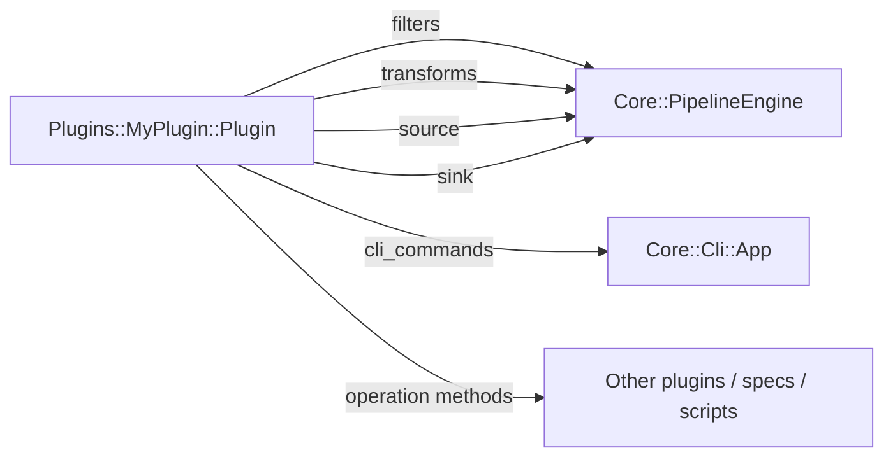

# Plugins

em-tools is plugin-driven: the **core** has zero business knowledge, and
every marketplace / channel lives under `lib/em_tools/plugins/<scope>/`. This
document is the plugin contract — read it before adding a new plugin or a
new CLI command.

> **Design rationale (中文)** — when to add a plugin vs put logic in Core,
> and why we partition by *business channel* rather than by ES cluster/index:
> [`PLUGIN_BOUNDARIES.md`](PLUGIN_BOUNDARIES.md).

> em-tools is a project-local Ruby application, not a packaged gem; the
> "plugin" concept is internal to this checkout, not a rubygems extension
> point. New plugins are checked into the same repo.

## Plugin contract

Every plugin is a Ruby class under `EmTools::Plugins::<Name>` that inherits
from {EmTools::Core::Plugin::Base} and self-registers with the registry on
load:

```ruby
# lib/em_tools/plugins/my_plugin/plugin.rb
module EmTools
  module Plugins
    module MyPlugin
      class Plugin < EmTools::Core::Plugin::Base
        def self.plugin_name = :my_plugin

        EmTools::Core::PluginRegistry.register(plugin_name, self)
      end
    end
  end
end
```

Two lines, two responsibilities:

1. **`def self.plugin_name = :my_plugin`** — the plugin declares its
   identifier itself. It is the single source of truth (used for the CLI
   namespace, log progname, settings keys, …).
2. **`PluginRegistry.register(plugin_name, self)`** — the plugin opts in
   to being discovered. Always pass `plugin_name`, never a raw symbol —
   that way the symbol literal lives in exactly one place and can't drift.

`lib/em_tools.rb` requires every `plugins/*/plugin.rb` at load time, so the
registration is automatic. Everything else under your plugin directory is
autoloaded by Zeitwerk, no `require` calls necessary.

## What a plugin can contribute



| Slot | Method to override | Returns | Used by |
|---|---|---|---|
| Filters | `#filters` | `Array` of classes responding to `.new.call(record) -> truthy/falsy` | `PipelineEngine` |
| Transforms | `#transforms` | `Array` of classes responding to `.new.call(record) -> record` | `PipelineEngine` |
| Source | `#source(**opts)` | object responding to `#each` | pipelines / engine |
| Sink | `#sink(**opts)` | object responding to `#index(record)` (and optional `#flush!`) | pipelines / engine |
| CLI namespace | `.cli_namespace` | `String` (top-level subcommand name; default: kebab-case of the symbol passed to `register(:..., self)`) | `Core::Cli::Registry` |
| CLI commands | `#cli_commands` | `Hash<String, Dry::CLI::Command class>` (path *relative* to `cli_namespace`) | `Core::Cli::App` |
| Operations | any plain instance method | whatever the caller needs | other plugins / specs / scripts |

The "operation methods" slot is the escape hatch for workflows that do not
fit the per-record `filter→transform→sink` model — for example, the Amazon
upload runner, which spans several stages and pages of orchestration. Expose
those as instance methods on your plugin (`def upload_runner(**opts) =
Pipelines::UploadProductsFromEs::Runner.new(**opts) end`) so callers and the
CLI can grab one without reaching into your internals.

See {EmTools::Plugins::Amazon::Uploadable::Plugin} and
{EmTools::Plugins::Storefront::Plugin} for canonical examples.

## Recommended directory layout

```
lib/em_tools/plugins/<name>/
  plugin.rb                          # class Plugin < Base + register
  cli/                               # Dry::CLI::Command classes
    my_command.rb                    # EmTools::Plugins::<Name>::Cli::MyCommand
  pipelines/                         # multi-stage orchestrations
    do_thing.rb
  runners/                           # long-running streaming workers
    sync_inventory.rb
  filters/                           # per-record predicates
    eligible.rb
  transforms/                        # per-record reshaping
    normalize_currency.rb
  sources/                           # data ingress (GCS, ES, HTTP, file)
    seed_files.rb
  sinks/                             # ES bulk writers, NDJSON dumpers
    coverage_snapshot.rb
  queries/                           # ES query builders
    coverage.rb
spec/em_tools/plugins/<name>/        # mirror of the above
```

The names above match what is already in tree — if your contribution doesn't
need a particular subdirectory, omit it. Zeitwerk discovers everything.

## CLI naming contract (hierarchical)

The CLI is a hierarchical subcommand tree powered by [dry-cli], shaped like
`kubectl` / `git`:

```
em-tools <area> <action> [options] [arguments]
```

[dry-cli]: https://dry-rb.org/gems/dry-cli/

A plugin contributes commands under a single top-level token — its
**`cli_namespace`** — and supplies a hash of *subcommand-relative* paths to
`Dry::CLI::Command` classes. The registry prepends `cli_namespace` at boot.

| Plugin | `cli_namespace` | Example invocation |
|---|---|---|
| `:storefront` | `storefront` (default) | `em-tools storefront import-products …` |
| `:amazon` | `amazon` (default) | `em-tools amazon products filter …` / `em-tools amazon coverage publish-snapshot …` |
| `:ebay` | `ebay` (default) | `em-tools ebay listings publish-snapshot …` |
| `:lazada` | `lazada` (default) | `em-tools lazada products build-upload …` |

### How `plugin_name` and `cli_namespace` are decided

The plugin's identifier is **declared on the plugin class itself** with an
endless method, and then re-used in the registry call. There is **no**
auto-derivation from the Ruby class name (`EmTools::Plugins::Foo::Plugin`
→ `:foo`) — that machinery used to exist and is exactly how a copy-pasted
`register(:ssg, self)` line silently masked a sibling plugin in the past.

The flow is:

1. **Plugin declares its name on itself:**

   ```ruby
   def self.plugin_name = :my_plugin
   ```

2. **Plugin registers itself, passing its declared name:**

   ```ruby
   EmTools::Core::PluginRegistry.register(plugin_name, self)
   ```

   Always `plugin_name`, never a hard-coded symbol — that keeps the symbol
   literal in exactly one place per plugin file.

3. **`Plugin.cli_namespace` defaults to `plugin_name.to_s.tr("_", "-")`**,
   so `:storefront` → `"storefront"`. A plugin can override `self.cli_namespace`
   to a literal string when the default kebab-case is not what you want:

   ```ruby
   class Plugin < EmTools::Core::Plugin::Base
     def self.plugin_name   = :acme_feed
     def self.cli_namespace = "acme"

     EmTools::Core::PluginRegistry.register(plugin_name, self)
   end
   ```

If a plugin class is used (e.g. by `Cli::Registry`) without ever declaring
`plugin_name` *and* without being registered, `Plugin.cli_namespace`
raises `EmTools::Core::Plugin::NotRegisteredError` at boot — a fast, named
failure instead of "the plugin silently doesn't appear in the CLI".

The project does **not** carry legacy command aliases. Renaming a plugin
command is a one-shot rename: change `cli_commands`, update any docs / cron
/ scripts in the same commit.

## Adding a CLI command to an existing plugin

1. Add a `Dry::CLI::Command` subclass under `cli/`:

   ```ruby
   # lib/em_tools/plugins/my_plugin/cli/do_thing.rb
   require "dry/cli"

   module EmTools
     module Plugins
       module MyPlugin
         module Cli
           class DoThing < Dry::CLI::Command
             desc "Run the my_plugin do-thing pipeline"

             argument :input_path, required: true, desc: "Local NDJSON to consume"
             option :dry_run, type: :flag, default: false, desc: "Resolve only; skip side effects"
             option :batch_size, default: "500", desc: "Docs per request (default: 500)"

             example [
               "tmp/products.ndjson",
               "tmp/products.ndjson --dry-run",
             ]

             def call(input_path:, dry_run: false, batch_size: "500", **)
               EmTools::Core::Cli::Runner.run do
                 EmTools::Plugins::MyPlugin::Pipelines::DoThing.new(
                   path: input_path,
                   dry_run: dry_run,
                   batch_size: Integer(batch_size),
                 ).run!
               end
             end
           end
         end
       end
     end
   end
   ```

   Notes:
   - `desc` is the one-line summary shown in the parent's subcommand listing.
   - `option …, type: :flag` produces a single `--dry-run` switch; `:boolean`
     produces `--[no-]dry-run`. Use `:flag` unless you actually want the
     negative form.
   - dry-cli does not coerce option types beyond `:flag`/`:boolean`/`:array`;
     wrap with `Integer(...)` / `Float(...)` in `call`.
   - Wrap business work in {EmTools::Core::Cli::Runner.run} to translate
     `ConfigurationError` / `EmptyResultError` into a one-line stderr message
     and `exit 1`.

2. Wire it into the plugin's `cli_commands` (path **relative** to the
   namespace — the registry prepends `cli_namespace`):

   ```ruby
   def cli_commands
     {
       "do-thing" => Cli::DoThing,
       # multi-level paths are allowed:
       "products do-thing" => Cli::DoThing,
     }
   end
   ```

3. (Optional) Mention the command in [`docs/CLI.md`](CLI.md).

The command appears in `bundle exec bin/em-tools <namespace>` automatically.
Top-level discovery (`bundle exec bin/em-tools`) shows every namespace as a
subtree.

## Adding a brand-new plugin

```bash
mkdir -p lib/em_tools/plugins/my_plugin/{cli,pipelines,filters,transforms,sources,sinks}
mkdir -p spec/em_tools/plugins/my_plugin
```

Then:

1. Create `lib/em_tools/plugins/my_plugin/plugin.rb` (see top of this file).
2. Override the methods you need. At minimum, most plugins override
   `cli_commands` plus a few operation methods.
3. Add tests under `spec/em_tools/plugins/my_plugin/`.
4. Run the suite:

   ```bash
   bundle exec rspec
   bundle exec rubocop
   bundle exec bin/em-tools           # smoke-test the new namespace
   bundle exec bin/em-tools my-plugin # subtree listing
   ```

5. Update [`CHANGELOG.md`](../CHANGELOG.md) and, if this plugin warrants one,
   a row in the plugin table in [`OVERVIEW.md`](OVERVIEW.md). If the plugin
   exposes a recurring job, also add it to
   [`../schedule/README.md`](../schedule/README.md).

## Error handling

Plugins should raise the gem's typed errors instead of bare `RuntimeError` /
`ArgumentError`:

| Situation | Raise |
|---|---|
| Missing / invalid env var, missing credentials, missing config file | {EmTools::Core::Errors::ConfigurationError} |
| Pipeline ran end-to-end but produced an empty / unusable result | {EmTools::Core::Errors::EmptyResultError} |
| Anything else (real bug) | regular `StandardError` subclass |

Both typed errors inherit from {EmTools::Error}, so callers can do a single
`rescue EmTools::Error` to distinguish "em-tools refused" from unrelated
failures (HTTP, IO, etc).

## Testing

- Mirror the production layout under `spec/em_tools/plugins/<name>/`.
- Test command classes via the dry-cli interface: instantiate the class and
  call `#call(**)` with the kwargs you'd expect after option parsing.
- Use real classes and real ES query payloads; mock external HTTP / GCS at
  the client boundary, not in the plugin itself.
- Use `EmTools::Core::Logger.silent!` (already wired in `spec_helper.rb`)
  so plugin logs don't pollute test output.
