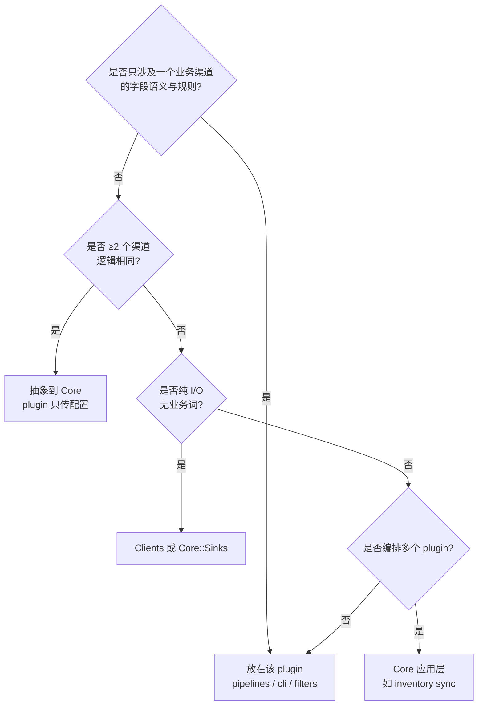

# Plugin 边界与设计理由

> 查阅用：回答「每个数据源是否该做一个 plugin」「新能力该放 Core 还是 plugin」。
> 配套阅读：[`PLUGINS.md`](PLUGINS.md)（合约）、[`ARCHITECTURE.md`](ARCHITECTURE.md)（分层）、
> [`DDD_AND_UBIQUITOUS_LANGUAGE.md`](DDD_AND_UBIQUITOUS_LANGUAGE.md)（限界上下文）。

---

## 1. 结论（TL;DR）

em-tools 的 plugin **按业务渠道 / 限界上下文划分**（如 `amazon`、`ebay`、`lotteon`），
**不是**按「每个 Elasticsearch 集群」或「每个 index」划分。

对当前规模（约 6 个 in-tree plugin、单一 operator、CLI + cron 运维），
**这种划分是合适的**。前提是：跨渠道重复的 ETL 能力放在 **Core**，plugin 只承载该域的语义与规则。

---

## 2. 模型对照

| 说法 | 在 em-tools 里实际指什么 | 放在哪一层 |
|------|--------------------------|------------|
| 数据源（技术） | ES 集群 URL、`user1_*` / `amz_*` 索引 | **配置**（`ELASTICSEARCH_URL`、`DATA_ELASTICSEARCH_URL`）+ CLI 参数 |
| 业务渠道 | Amazon、eBay、Lotteon… | **Plugin**（`lib/em_tools/plugins/<name>/`） |
| 用例 / 管道 | ASIN 同步、coverage snapshot、inventory 导出 | Plugin 内 `pipelines/`、`cli/`；跨渠道编排可在 **Core**（如 `inventory/sync`） |
| 基础设施 | bulk、mget、PIT 扫描、双集群路由 | **Core** + `Clients::ElasticsearchClient` |

**Plugin ≈ 业务渠道 + 该渠道的数据语义**，而不是「一个 URL = 一个 plugin」。

示例：`user1_amz_asins` → `amz_asins_{marketplace}` 放在 `plugins/amazon/asin_sync/`，
因为 marketplace 映射、ASIN 校验、目标 doc 形状都属于 Amazon 域；集群地址仍由 `.env` 解决。

---

## 3. 为什么按渠道做 plugin 是合适的

### 3.1 与限界上下文（DDD）一致

不同渠道的**通用语言**不同（ASIN / product_id、索引命名、上架规则、coverage 定义）。
按 plugin 分目录，类名、CLI、`docs/` 与评审用语可以跟业务对齐，减少「在 eBay 改代码误伤 Amazon」。

### 3.2 变更隔离

各渠道 ES mapping、过滤条件、cron 频率、业务规则迭代节奏不同。
Plugin 边界把回归范围限制在一个渠道内。

### 3.3 与运维模型一致

- 唯一入口：`bundle exec bin/em-tools <plugin-namespace> …`
- 定时任务：cron 调同一二进制，只是子命令不同（见 `schedule/`）
- 注册：`plugins/*/plugin.rb` 启动时 `PluginRegistry.register`，无需改 Core 分发逻辑

### 3.4 规模匹配

见 [`notes/PLATFORM_EVOLUTION.md`](notes/PLATFORM_EVOLUTION.md)：当前不需要外置 plugin 市场、
动态 manifest、多租户 runtime。In-repo plugin 成本最低、可测性足够。

### 3.5 Core 已承担「横向能力」

以下**不应**在每个 plugin 里各复制一份：

- `ElasticsearchBulkSink`、`ElasticsearchClient`（PIT、`mget`、`bulk`）
- `Core::Inventory::SyncRunner`（多 source 写入 `em_inventory`）
- `Core::Blacklist`、共享 logger / config / CLI `Runner`

Plugin 负责「这条业务线里记录长什么样、该不该写入」。

---

## 4. 什么时候不合适 / 需要调整

| 信号 | 问题 | 建议 |
|------|------|------|
| 每个小脚本、每个 index 都新建 plugin | 目录与 CLI 爆炸，大量重复 bulk 逻辑 | 收到 **Core** 或现有 plugin 的 `pipelines/` |
| 同一 plugin 无限堆无关能力 | 「上帝 plugin」（如 Amazon 同时 upload、coverage、asin_sync 再继续膨胀） | 用**子目录**划子域（`uploadable/`、`lowest_offer/`、`asin_sync/`）；仅当发布/团队边界需要时再拆成第二个 plugin |
| ≥3 个渠道逻辑几乎相同的 ETL | 五份复制粘贴 | 在 Core 抽象泛化 pipeline，plugin 只传配置（index 名、字段映射） |
| 需要独立版本、独立部署某渠道 | Monorepo 绑在一起发布 | 再评估外置 plugin / manifest（演进路线 Stage 2，**按需**） |

### 4.1 不建议：按集群或按 index 划 plugin

若严格「每个数据源一个 plugin」，可能得到 `user1_es`、`primary_es` 等——
边界落在**基础设施**上，而不是业务上；几十个 index 无法对应 operator 的心智模型。

推荐保持：

```
集群 URL     → .env（ELASTICSEARCH_URL / DATA_ELASTICSEARCH_URL）
业务         → plugin（amazon、ebay、…）
具体 index   → plugin 内常量或 CLI 选项（如 user1_amz_asins、amz_asins_de）
```

---

## 5. 新能力放哪里的决策树



**例子**

| 能力 | 归属 | 理由 |
|------|------|------|
| `amazon asins sync-user1` | `plugins/amazon/asin_sync/` | marketplace、ASIN 形状、目标索引命名 |
| `inventory sync` | `core/inventory/` | 多 source、统一 sink `em_inventory` |
| `ElasticsearchClient#iterate_query` | `clients/` | 与业务无关的传输 |
| 假设未来「eBay user1 → ebay_asins_*」 | `plugins/ebay/…` 或 Core 泛化 + 两 plugin 配置 | 与 Amazon 对称时先复制一版；第三渠道再抽象 |

---

## 6. 与「每个数据源一个 plugin」说法的对照

若团队口头说「一个数据源一个 plugin」，建议统一成下面表述，避免误解：

- **推荐说法**：一个**业务渠道**（或**限界上下文**）一个 plugin。
- **不推荐**：一个 ES 集群、一个 index、一条 cron 脚本各做一个 plugin。

Cron / 脚本（如 `bin/amazon-sync-user1-amz-asins`）是**运维入口**，不是 plugin 边界；
底层仍应调用 `em-tools amazon …`，逻辑留在 `plugins/amazon/`。

---

## 7. 当前 in-tree plugin 一览（便于对照）

| Plugin | 典型职责 |
|--------|----------|
| `amazon` | 上架候选、ASIN 流、coverage snapshot、user1→amz_asins 同步 |
| `ebay` | listings coverage、product_id 导出等 |
| `storefront` | 目录导入、下架候选 |
| `lotteon` / `ssg` / `oliveyoung` | 渠道商品导出 |
| `google_ads` / `lazada` | 广告 / 区域相关导出 |

新增渠道：复制 [`PLUGINS.md`](PLUGINS.md) 合约，新增 `lib/em_tools/plugins/<name>/plugin.rb` 并注册 CLI。

---

## 8. 相关文档

| 文档 | 内容 |
|------|------|
| [`PLUGINS.md`](PLUGINS.md) | Plugin 合约、目录布局、CLI 命名 |
| [`ARCHITECTURE.md`](ARCHITECTURE.md) | ETL 分层、Zeitwerk、启动流程 |
| [`DDD_AND_UBIQUITOUS_LANGUAGE.md`](DDD_AND_UBIQUITOUS_LANGUAGE.md) | 限界上下文与通用语言表 |
| [`notes/PLATFORM_EVOLUTION.md`](notes/PLATFORM_EVOLUTION.md) | 何时做 lazy load、DAG、外置 plugin |
| [`schedule/README.md`](../schedule/README.md) | Cron 如何调用同一 CLI |

---

*最后更新：2026-06-01（ASIN 跨集群同步 `amazon/asin_sync` 落地后的设计备忘）。*
