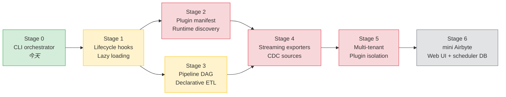
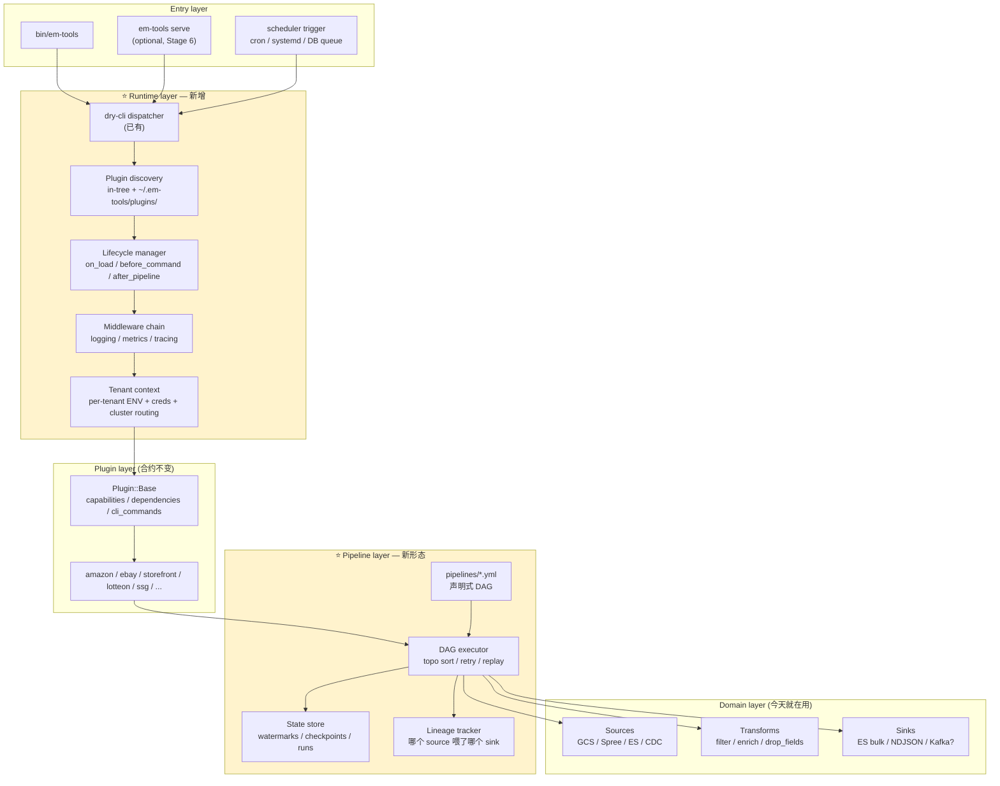

# em-tools 架构演进路线（CLI → Data Platform Runtime）

> 这是一份**工程时序图 + 决策表**，不是 marketing roadmap。
> 每个阶段标了 *加什么 / 改什么 / 触发条件 / 成本 / 退出路径*，
> 配合 [`ARCHITECTURE.md`](../ARCHITECTURE.md) 看当前架构。
>
> 本文目的：把"什么时候该升级"明确化，避免重复讨论"要不要做 Shopify-style runtime"
> 这一类问题。

---

## 0. TL;DR

按 em-tools 当前的实际尺度（1 个 operator、6 个 in-tree plugin、~20 个命令），
**两步有真实 ROI、其它按需**：

1. **Stage 1 — Lifecycle hooks + lazy load**（1 周成本，低风险，所有 cross-cutting
   concerns 的地基）
2. **Stage 3 — Pipeline DAG**（3-4 周，把 ETL 变成声明式 data platform 的关键一步）

其它阶段（manifest discovery / streaming / multi-tenant / mini-Airbyte）
**都等明确的业务信号再做**。第 7 节有具体信号清单。

---

## 1. 演进总图（成熟度阶梯）



颜色含义：

- 🟢 已完成 — **Stage 0**（dry-cli 命令树 + plugin registry）
- 🟡 推荐做 — **Stage 1, 3**（真有 ROI）
- 🔴 按需做 — **Stage 2, 4, 5**（等明确信号再做）
- ⚫ 大概率永远不做 — **Stage 6**（那是另一个产品）

注意阶梯不是单链：**Stage 2 和 Stage 3 是平行可选**，做哪一个先取决于业务驱动是
"plugin 数量爆炸"还是"pipeline 数量爆炸"。Stage 4 同时依赖前面两个。

---

## 2. 终态分层架构（如果走完 Stage 5）



带 ⭐ 的两块是"现在没有，未来加的"。其它都是 em-tools 今天已经有的。
**Plugin 合约不需要推翻** —— 这是关键设计原则：增加能力，不重写合约。

---

## 3. 阶段详表

| # | 名字 | 加什么（代码层面） | 触发条件 | 成本 | 风险 | 可不可逆 |
|---|---|---|---|---|---|---|
| 0 | CLI orchestrator | 当前：`Cli::App` + dry-cli + `Plugin::Base` + `Pipelines::*` Ruby class | — | — | — | — |
| 1 | Lifecycle + lazy load | `Plugin#on_load`/`on_unload`/`on_command_*` 钩子；`Cli::Middleware` 链；按 `cli_namespace` 懒加载 plugin | 启动 >2s ｜ 命令 50+ ｜ 想统一观测 | **1 周** | 低 | 可逆 |
| 2 | Manifest + discovery | `plugin.toml`（命令路径、参数 schema、版本、依赖）；`~/.em-tools/plugins/` 扫描；schema-driven argv 解析 | 出现仓库**外**的 plugin ｜ 多团队共建 | **2-3 周** | 中（schema 演化） | 半可逆 |
| 3 | Pipeline DAG | `pipelines/*.yml`（source → transforms → sink 的有向图）；DAG executor（topo sort + retry + 部分回放）；state store（每节点 watermark + 上次运行）；lineage 表 | pipeline 数 >10 ｜ 需要 partial replay ｜ 调试要 lineage | **3-4 周** | 中 | 不可逆（写新 pipeline 都用 YAML） |
| 4 | Streaming exporters | `Source#each_change(since:)` 合约；CDC 接入（ES PIT 已有，扩展到 Spree webhook / Kafka）；sink 原生 upsert/delete | 延迟要求 <5min ｜ 当前 batch 跑得越来越慢 | **2-3 周** | 中（顺序 / exactly-once 边界） | 加性，可保留 batch 路径 |
| 5 | Multi-tenant | `tenants/*.yml`；CLI 加 `--tenant`；进程级隔离（per-tenant ENV、cluster URL、credential vault）；plugin sandbox（一个 tenant 失败不污染另一个） | 给非自己用 ｜ 客户隔离合规要求 | **3-5 周** | 高（credential 隔离做错就是事故） | 不可逆 |
| 6 | mini Airbyte | Web UI；DB 调度器（不是 cron）；webhook trigger；可视化 lineage；run history | 想把 em-tools 产品化 / 卖出去 | **2-3 个月** | 高 | 等于另一个项目 |

总和：如果一路走完 Stage 5，**~3 个月专职工时**。Stage 6 再 2-3 个月。

---

## 4. 每个阶段，plugin 合约怎么变

| 阶段 | `Plugin::Base` 接口 | `cli_commands` | `Pipelines::*` |
|---|---|---|---|
| 0 (今天) | `capabilities/dependencies/cli_commands/cli_namespace` | 路径 → `Dry::CLI::Command` | imperative Ruby class |
| 1 | **加** `on_load/on_command_*` (默认空实现) | 不变 | 不变 |
| 2 | 不变（manifest 是 plugin 外的描述） | 不变 | 不变 |
| 3 | **加** `pipelines` 方法（返回 DAG 节点工厂） | 不变 | YAML 描述 + Ruby class 注册节点类型 |
| 4 | **加** `Source#each_change`（可选） | 不变 | DAG 节点支持 streaming 语义 |
| 5 | **加** `with_tenant(tenant_ctx)` 工厂 | 不变（CLI 解析 `--tenant` 后注入） | DAG 节点拿到 `tenant_ctx` |

**关键点**：plugin 写法在 6 个阶段里基本不变，只是**外部增加了能力**，不是推翻。
这是正确的演进方式 —— Plugin 是合约边界，runtime 是底下的脚手架。

---

## 5. 各阶段的具体改动指引

### Stage 1 — Lifecycle hooks + lazy load

**目的**：不动业务逻辑，给 runtime 加上 cross-cutting 钩子；按 namespace 懒加载，
启动只 require 命令真正用到的 plugin。

**代码改动**：

```ruby
# lib/em_tools/core/plugin/base.rb 加默认空实现
def on_load(_runtime); end
def on_command_started(_command_path, _argv); end
def on_command_finished(_command_path, _result); end

# lib/em_tools/core/cli/middleware.rb (新)
module EmTools::Core::Cli::Middleware
  # 链式装饰器：每个中间件 .new(next_middleware).call(ctx)
  # 内置：Logging / Metrics / Tracing / RescueTypedErrors
end

# lib/em_tools/core/cli/registry.rb 改为按需加载
# 第一次执行 "amazon products filter" 时才 require plugin.rb
```

**需要回答的设计问题**：

- 钩子是同步还是异步？（建议同步，简单）
- 中间件链是按 plugin 注册还是全局注册？（建议全局注册 + plugin 可以贡献中间件）
- Lazy load 的 manifest 写在哪？最小成本是用每个 plugin 的 `cli_namespace` 作为目录约定

**退出路径**：钩子默认空实现，懒加载有 `EM_TOOLS_EAGER_LOAD=1` 兜底。完全可逆。

---

### Stage 3 — Pipeline DAG

**目的**：把 `Pipelines::*` Ruby 类的命令式编排，迁移成 YAML 描述的有向图。

**伪代码**：

```yaml
# pipelines/inventory_to_es.yml
name: inventory_to_es
schedule: 30 3 * * *  # 可选
nodes:
  - id: gcs_source
    type: gcs.csv_source
    config:
      gs_uri: gs://em-bucket/AMZ_US-Inv.csv
  - id: drop_fields
    type: core.drop_fields
    inputs: [gcs_source]
    config: { fields: [handle, variants] }
  - id: es_sink
    type: core.es_bulk
    inputs: [drop_fields]
    config: { index: user1_amz_us_products, cluster: data }
```

```ruby
# lib/em_tools/core/pipelines/dag/executor.rb (新)
class Executor
  def run!(pipeline_path, replay_from: nil)
    # 1. 读 YAML
    # 2. topo sort
    # 3. 每个节点查 state store 看上次 watermark
    # 4. 失败的节点支持 --replay-from
    # 5. 写 lineage 表
  end
end

# 节点类型注册
# Plugin#pipelines 返回 { "amz.something" => SomeNodeClass } 之类的注册项
```

**State store**：先用 SQLite（项目内 `tmp/em-tools-state.sqlite3`），不要为这个引数据库依赖。

**Lineage**：每次运行写一行 `{run_id, pipeline, node, inputs_run_ids, status, started_at, finished_at, rows_in, rows_out}`。可以查、可以画。

**和当前 `Pipelines::*` 的关系**：

- 当前 `Pipelines::ProductDownload` / `Pipelines::PublishSnapshot` 等保留
- 新写的 pipeline 用 YAML
- 老的 imperative pipeline 可以包成 DAG 里的"single-node pipeline"逐步迁移
- 不强制重写，自然替换

---

### Stage 2 — Manifest + discovery（按需）

**目的**：让 plugin 可以 live in repo 之外。

**先不要做**，除非你真的有第二个 git repo 想贡献 plugin。In-tree 用 `Dir[plugins/*/plugin.rb]`
是合适的，简单到不能再简单。Manifest 是给陌生 plugin 用的。

**真要做的话**：

```toml
# ~/.em-tools/plugins/some_plugin/plugin.toml
name = "some_plugin"
cli_namespace = "some-plugin"
version = "0.1.0"
ruby_require = "lib/some_plugin/plugin.rb"

[[commands]]
path = "do-thing"
description = "..."
arguments = [{ name = "input_path", required = true }]
options = [{ name = "dry-run", type = "boolean", default = false }]
```

`Cli::Registry` 加一步：扫 `~/.em-tools/plugins/*/plugin.toml`，按 manifest 注册命令。

---

### Stage 4 — Streaming（按需）

**目的**：把 batch ETL 改成 push-based。

**前置条件**：Stage 3 的 DAG executor 支持长生命周期节点（不只是一次性运行）。

**改动**：

- `Source#each_change(since: cursor)` 合约，源决定增量怎么算（ES PIT、Kafka offset、HTTP webhook）
- DAG 节点声明语义：`streaming` 还是 `batch`
- Sink 原生支持 upsert / delete（当前 ES bulk sink 只做 index/create）

**风险**：exactly-once 是分布式难题。建议**永远不要承诺 exactly-once**，承诺
"at-least-once + idempotent sink"，要求 sink 端自己幂等。

---

### Stage 5 — Multi-tenant（按需）

**目的**：同一份代码服务多个客户/团队。

**改动**：

```yaml
# tenants/customer_a.yml
elasticsearch_url_env: CUSTOMER_A_ES_URL
gcs_credentials_env: CUSTOMER_A_GCS_KEY
inventory_index_prefix: customer_a_
```

```bash
em-tools --tenant customer_a inventory sync
```

**进程级隔离**：每个 tenant 跑在独立子进程里（fork + setenv），credential 不共享内存。

**最大风险**：credential 隔离。一旦 customer_a 的代码 bug 拿到 customer_b 的 ES 凭证，
就是事故。**Stage 5 的工程量主要花在 isolation testing 上**，不是功能本身。

**建议**：除非有合规/客户硬要求，否则**永远不要走到 Stage 5**。多 operator 用
"每个 operator 自己 fork + 自己的 .env" 的方式解决，比 multi-tenant 简单 10 倍。

---

### Stage 6 — mini Airbyte（不做）

**为什么不做**：那是产品化方向，需要：

- 一个长期跑的 web 服务（运维负担）
- 持久化的调度器 DB（PostgreSQL/MySQL）
- 用户认证 / RBAC
- 一个前端

**em-tools 是 internal tool**。如果某天真要做 mini Airbyte，建议**新开一个项目**，
用 em-tools 作为 SDK / library 嵌进去，而不是在 em-tools 里塞 web 服务。

---

## 6. 反向问题：哪些**不做**也写在路线图里

把它们记下来，不然每个新贡献者都会重复提：

- ❌ **跨语言 runtime（Node/Bun shim）**：em-tools 是 Ruby 项目，引第二个 runtime 是给自己挖坑
- ❌ **公共 plugin marketplace**：私有 internal tool，没必要
- ❌ **DI container（dry-system / 类似）**：当前构造器注入足够，加 container 是炫技
- ❌ **command-level event sourcing**：CLI 不需要重放历史命令
- ❌ **gRPC / REST API for CLI commands**：除非走到 Stage 6，否则没意义
- ❌ **自研 scheduler**：cron / systemd timer 已经解决，写一个 Sidekiq-cron 类的东西是 NIH

---

## 7. 信号化的"该做 Stage N 了"清单

在 Stage 0 期间持续观察。出现以下任一信号，对应阶段就该启动：

| 信号 | 触发 | 迟做的代价 |
|---|---|---|
| `bundle exec bin/em-tools --help` >2s | Stage 1（lazy load） | 启动慢传染到所有命令，体验差 |
| 你想给所有命令加 metrics 但不想改 17 个文件 | Stage 1（middleware） | 每加一个 cross-cutting concern 都是 N 处改动 |
| `pipelines/` 下有 >5 个文件，互相调用 | Stage 3 | 调试链路靠肉眼 grep |
| 跑一半挂了，要重跑只能从头 | Stage 3（state + replay） | 每次故障多浪费一晚上 |
| 别人的 fork 想加 plugin，但你的 Gemfile 拦着 | Stage 2 | 强迫他们 fork 你的项目 |
| 凌晨 3 点 inventory sync 挂了，影响早上 9 点 dashboard | Stage 4（streaming） | 每天有 6 小时的数据延迟窗口 |
| 团队来了第二个人，他想动你的 ENV 但不能 | Stage 5（tenant） | 共用 .env 是事故制造机 |

---

## 8. ROI 排序的执行建议

| 优先级 | 阶段 | 何时做 |
|---|---|---|
| 1 | **Stage 1** | 今年内，1 周搞定，所有后续阶段的地基 |
| 2 | **Stage 3** | pipeline 数量到 ~10 / 第一次因部分回放骂街 时 |
| 3 | Stage 4 | 等明确的延迟需求 |
| 4 | Stage 5 | 等明确的隔离需求 |
| 5 | Stage 2 | 等真的有 out-of-tree plugin |
| — | Stage 6 | 不做 |

**最小可执行的下一步**：等 Stage 1 真要动手时，先开一个 issue / 笔记记录"为什么现在做"
的触发信号，再开始动代码。避免无信号驱动的过度设计。

---

## 9. 历史背景

- 2026-05：完成 Stage 0：CLI 从 colon-style namespace（`inventory:sync`）迁到 dry-cli
  hierarchical 命令树（`em-tools inventory sync`），plugin 合约同时收紧（`cli_namespace`
  + 子命令路径分离）。这是 Stage 1 的前置 —— 命令树清晰，lifecycle hook 才能挂得上。
- 评估并否决了 "Shopify-style CLI runtime" 一次性大重构，理由：
  em-tools 当前规模（1 operator、6 plugin、19 命令）撑不起自研 runtime 的维护成本。
  详见 [`CHANGELOG.md`](../../CHANGELOG.md) 中 dry-cli 迁移的条目。

